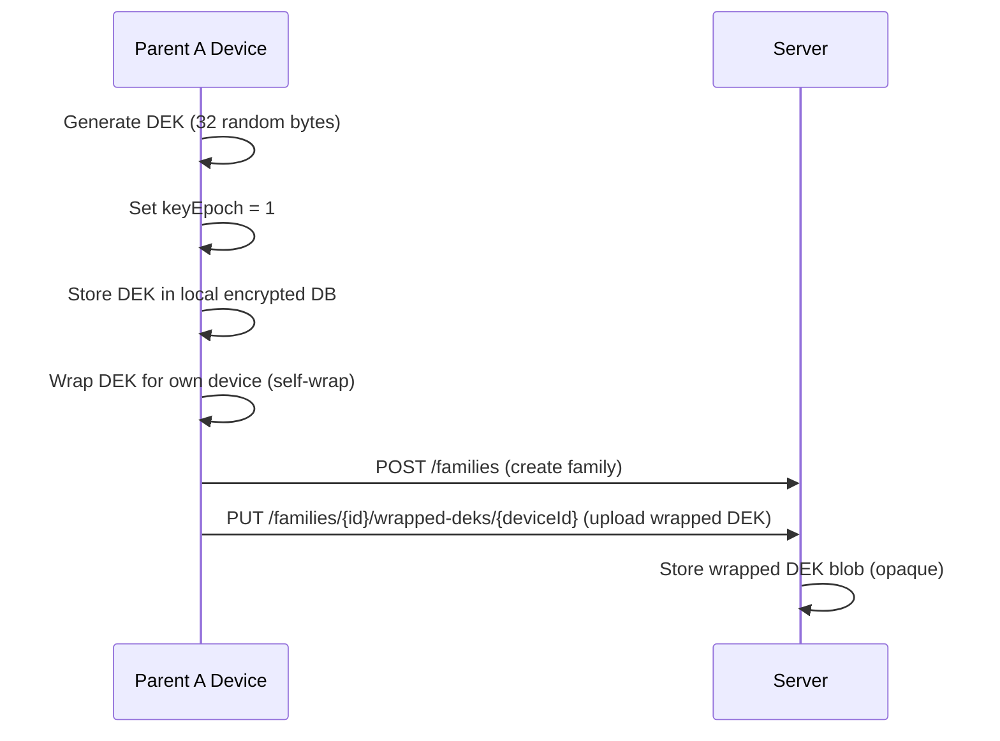
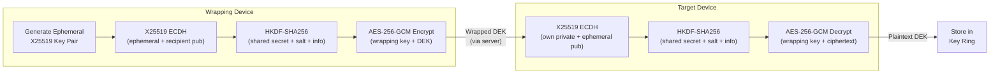
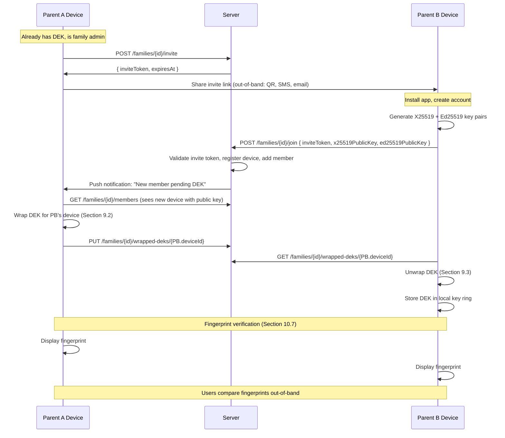
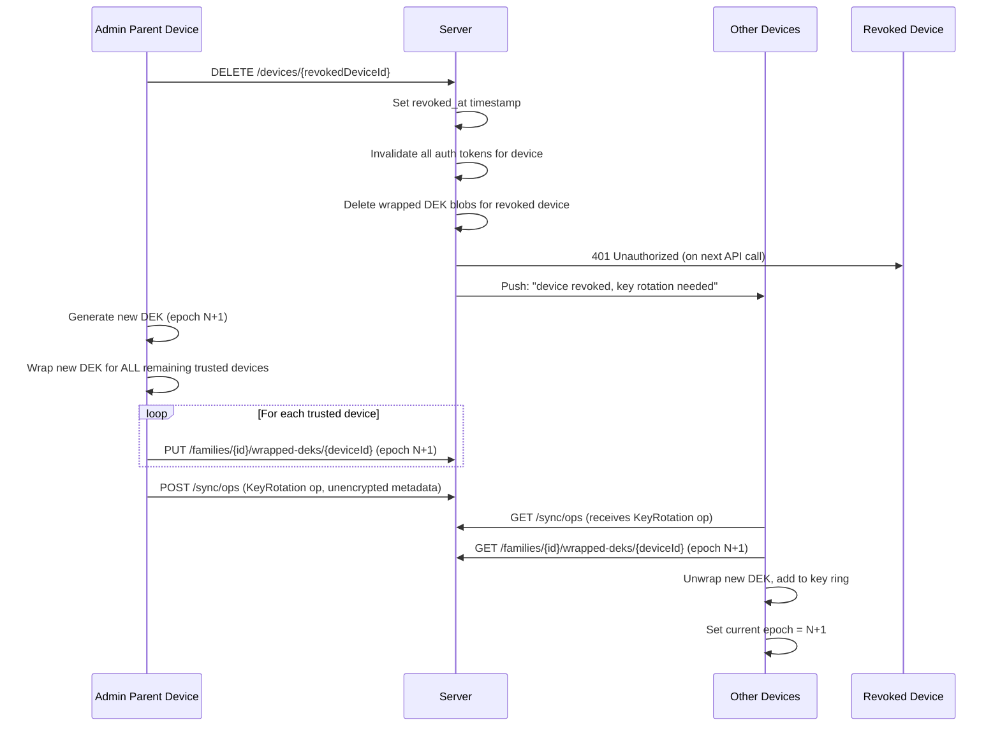
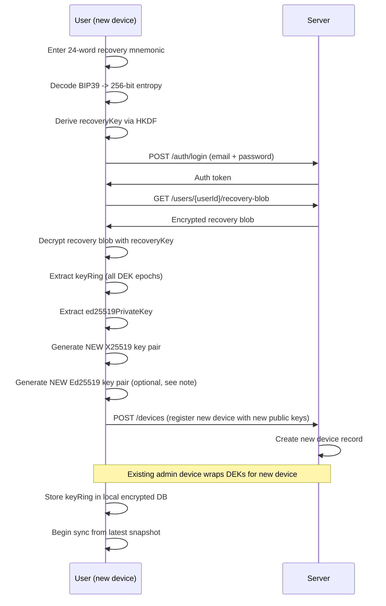

# KidSync Encryption Specification

**Version:** 1.0-draft
**Date:** 2026-02-20
**Status:** Draft (requires review before Gate P0 freeze)
**Applies to:** All clients (Android, iOS) and the sync server
**Related documents:** `wire-format.md`, `sync-protocol.md`, `openapi.yaml`

---

## Table of Contents

1. [Design Principles](#1-design-principles)
2. [Threat Model](#2-threat-model)
3. [Crypto Profile](#3-crypto-profile)
4. [Key Hierarchy](#4-key-hierarchy)
5. [Key Formats and Encoding](#5-key-formats-and-encoding)
6. [Device Key Pair Generation and Storage](#6-device-key-pair-generation-and-storage)
7. [DEK Lifecycle](#7-dek-lifecycle)
8. [Key Epochs](#8-key-epochs)
9. [DEK Wrapping Protocol](#9-dek-wrapping-protocol)
10. [Device Enrollment Flow](#10-device-enrollment-flow)
11. [Device Revocation and DEK Rotation](#11-device-revocation-and-dek-rotation)
12. [OpLog Encryption and Decryption](#12-oplog-encryption-and-decryption)
13. [Blob Encryption](#13-blob-encryption)
14. [Hash Chain Integrity](#14-hash-chain-integrity)
15. [Snapshot Encryption and Signing](#15-snapshot-encryption-and-signing)
16. [Recovery Key](#16-recovery-key)
17. [Invite Link Security](#17-invite-link-security)
18. [Platform Implementation Notes](#18-platform-implementation-notes)
19. [Security Considerations](#19-security-considerations)
20. [Conformance Requirements](#20-conformance-requirements)
21. [Appendix A: Notation and Constants](#appendix-a-notation-and-constants)
22. [Appendix B: Key Format Diagrams](#appendix-b-key-format-diagrams)
23. [Appendix C: Worked Example](#appendix-c-worked-example)

---

## 1. Design Principles

1. **Zero-knowledge server.** The server is a "dumb relay." It never possesses plaintext
   family data, DEKs, or device private keys. A compromised server yields only ciphertext
   and metadata (timestamps, sequence numbers, device IDs).

2. **Defense in depth.** Data is protected at multiple layers: TLS in transit, AES-256-GCM
   for payload encryption, SQLCipher/encrypted CoreData at rest on-device, and
   hardware-backed key storage (Android Keystore / iOS Secure Enclave).

3. **Forward secrecy on revocation.** When a device is revoked, the family DEK is rotated.
   Future data is encrypted with a new key the revoked device cannot obtain. Historical
   data already downloaded by the revoked device is accepted as an inherent tradeoff --
   see [Section 19.5](#195-revoked-device-retains-historical-data).

4. **Cross-platform determinism.** All cryptographic operations use the same algorithms,
   parameters, and encoding across Android (Tink) and iOS (CryptoKit). Conformance test
   vectors (Section 20) guarantee interoperability.

5. **Simplicity over cleverness.** The protocol uses well-studied primitives (X25519,
   AES-256-GCM, HKDF-SHA256, Ed25519) composed in straightforward ways. No custom
   cryptographic constructions.

---

## 2. Threat Model

### 2.1 Adversaries

| Adversary | Capability | Goal |
|-----------|-----------|------|
| **Compromised server** | Full access to server storage, database, network traffic between server and clients | Read family data, tamper with sync stream |
| **Network attacker** | TLS interception (MITM), traffic analysis | Read or modify data in transit |
| **Malicious co-parent** | Legitimate app access, one valid device | Access data after being removed, tamper with historical record |
| **Stolen device** | Physical access to a locked/unlocked device | Extract keys, read family data |
| **Rogue app on device** | Userspace process on same device | Extract keys from memory, intercept IPC |

### 2.2 Security Properties

| Property | Guaranteed | Notes |
|----------|-----------|-------|
| **Confidentiality** | Yes | Server and network attacker cannot read plaintext |
| **Integrity** | Yes | Hash chains detect tampering; AES-GCM authenticates ciphertext; Ed25519 signs snapshots |
| **Forward secrecy (post-revocation)** | Yes | DEK rotation after device revocation |
| **Forward secrecy (per-message)** | No | All messages in an epoch share one DEK; per-message ratchet is out of scope for v1 |
| **Repudiation** | Partial | Ops are attributable to a deviceId but not cryptographically signed individually (snapshots are signed) |
| **Availability** | No | Server can deny service; this is inherent to a relay model |

### 2.3 Assumptions

- Device OS and hardware security modules (Keystore, Secure Enclave) are not compromised.
- Users verify fingerprints during device enrollment (see Section 10.7).
- TLS 1.3 is enforced for all client-server communication.
- The app does not run on rooted/jailbroken devices (best-effort detection, not a hard gate).

---

## 3. Crypto Profile

All platforms MUST use the following unified cryptographic profile. No algorithm
negotiation. Protocol version changes are required to change any algorithm.

| Function | Algorithm | Parameters |
|----------|-----------|------------|
| **Key Agreement** | X25519 (Curve25519 Diffie-Hellman) | 32-byte private key, 32-byte public key |
| **Payload Encryption** | AES-256-GCM | 256-bit key, 96-bit (12-byte) nonce, 128-bit (16-byte) authentication tag |
| **Key Derivation** | HKDF-SHA256 (RFC 5869) | Variable-length IKM, application-specific salt and info |
| **Hash** | SHA-256 | 256-bit (32-byte) output; used for hash chains, checksums, fingerprints |
| **Signing** | Ed25519 (RFC 8032) | 32-byte private key, 32-byte public key, 64-byte signature; used for snapshots and device attestation |
| **Compression** | gzip (RFC 1952) | Applied to plaintext before encryption |
| **Encoding** | Base64 (RFC 4648, standard alphabet, with padding) | For all binary-to-text encoding in JSON fields |
| **Recovery Mnemonic** | BIP39 (English wordlist) | 256 bits entropy = 24 words |

### 3.1 Platform Library Mapping

| Platform | Library | Notes |
|----------|---------|-------|
| **Android** | Google Tink | X25519 via `HybridEncrypt`/`HybridDecrypt` or raw key exchange; AES-256-GCM via `Aead`; HKDF via `Hkdf`; Ed25519 via `PublicKeySign`/`PublicKeyVerify`. Private keys stored in Android Keystore (hardware-backed where available). |
| **iOS** | Apple CryptoKit | X25519 via `Curve25519.KeyAgreement`; AES-256-GCM via `AES.GCM`; HKDF via `HKDF<SHA256>`; Ed25519 via `Curve25519.Signing`. Private keys stored in Secure Enclave where supported, Keychain otherwise. |
| **Server** | None (no crypto) | Server never performs encryption/decryption. It stores and relays opaque blobs. |

### 3.2 Nonce Generation

All nonces MUST be generated using a cryptographically secure random number generator
(CSRNG):

- Android: `java.security.SecureRandom`
- iOS: `SecRandomCopyBytes` or CryptoKit defaults

Nonces are 96 bits (12 bytes) for AES-256-GCM. Given the birthday bound for 96-bit
nonces (~2^48 messages per key before collision risk becomes non-negligible), and the
expected volume of a family co-parenting app (at most tens of thousands of operations per
DEK epoch), nonce collision probability is astronomically low. Random nonces are safe.

---

## 4. Key Hierarchy

```
                    ┌─────────────────────────┐
                    │   Recovery Key           │
                    │   (256-bit, BIP39)       │
                    │   User holds offline     │
                    └───────────┬─────────────┘
                                │ encrypts recovery blob
                                ▼
                    ┌─────────────────────────┐
                    │   Recovery Blob          │
                    │   (stored on server,     │
                    │    encrypted)            │
                    │   Contains: DEK + keys   │
                    └─────────────────────────┘

┌──────────────────────────────────────────────────────────────────────┐
│ FAMILY SCOPE                                                         │
│                                                                      │
│   ┌─────────────────────────┐                                        │
│   │   Family DEK            │                                        │
│   │   (AES-256, symmetric)  │◄──── One per family, versioned by      │
│   │   256-bit random        │      key epoch (monotonic integer)     │
│   └───────────┬─────────────┘                                        │
│               │                                                      │
│               │ encrypts                                             │
│               ▼                                                      │
│   ┌─────────────────────────┐   ┌──────────────────────────┐        │
│   │   OpLog Payloads        │   │   Blob Keys              │        │
│   │   (AES-256-GCM)        │   │   (per-blob AES-256 key  │        │
│   │                         │   │    stored in OpLog entry) │        │
│   └─────────────────────────┘   └──────────────────────────┘        │
│                                                                      │
└──────────────────────────────────────────────────────────────────────┘

┌──────────────────────────────────────────────────────────────────────┐
│ DEVICE SCOPE (one per enrolled device)                               │
│                                                                      │
│   ┌─────────────────────────┐   ┌──────────────────────────┐        │
│   │   X25519 Key Pair       │   │   Ed25519 Key Pair       │        │
│   │   (key agreement)       │   │   (signing)              │        │
│   │   Private: 32 bytes     │   │   Private: 32 bytes      │        │
│   │   Public: 32 bytes      │   │   Public: 32 bytes       │        │
│   └───────────┬─────────────┘   └──────────────────────────┘        │
│               │                                                      │
│               │ used to unwrap                                       │
│               ▼                                                      │
│   ┌─────────────────────────┐                                        │
│   │   Wrapped DEK Blob      │◄──── One per (device, epoch) pair     │
│   │   (stored on server)    │      Server stores, cannot decrypt    │
│   │   Contains encrypted    │                                        │
│   │   DEK bytes             │                                        │
│   └─────────────────────────┘                                        │
│                                                                      │
└──────────────────────────────────────────────────────────────────────┘
```

### 4.1 Key Relationships Summary

| Key | Type | Scope | Created By | Stored Where | Purpose |
|-----|------|-------|-----------|-------------|---------|
| Family DEK | AES-256 symmetric | Per family, per epoch | Creating parent's device | Wrapped on server, plaintext on-device only | Encrypt/decrypt all OpLog payloads |
| X25519 Key Pair | Asymmetric (key agreement) | Per device | Device itself | Private: device hardware store. Public: server `devices` table | Derive wrapping keys for DEK exchange |
| Ed25519 Key Pair | Asymmetric (signing) | Per device | Device itself | Private: device hardware store. Public: server `devices` table | Sign snapshots and attestations |
| Wrapped DEK | AES-256-GCM ciphertext | Per (device, epoch) | Wrapping device | Server `wrapped_deks` table | Transport DEK to a device without server seeing it |
| Per-Blob Key | AES-256 symmetric | Per blob | Uploading device | Inside OpLog entry (encrypted by DEK) | Encrypt individual binary blobs |
| Recovery Key | 256-bit entropy | Per user | User's device at onboarding | User's physical custody (paper/PDF) | Decrypt recovery blob to restore account |

---

## 5. Key Formats and Encoding

### 5.1 Raw Key Material

| Key | Raw Size | Format |
|-----|----------|--------|
| X25519 private key | 32 bytes | Raw Curve25519 scalar (clamped per RFC 7748) |
| X25519 public key | 32 bytes | Raw Curve25519 u-coordinate |
| Ed25519 private key | 32 bytes | Raw Ed25519 seed |
| Ed25519 public key | 32 bytes | Raw Ed25519 point (compressed) |
| Family DEK | 32 bytes | Raw AES-256 key |
| Per-Blob Key | 32 bytes | Raw AES-256 key |
| AES-256-GCM nonce | 12 bytes | Random |
| AES-256-GCM tag | 16 bytes | Appended to ciphertext |

### 5.2 Wrapped DEK Envelope (JSON)

The wrapped DEK blob stored on the server for each device follows this format:

```json
{
  "version": 1,
  "keyEpoch": 1,
  "deviceId": "550e8400-e29b-41d4-a716-446655440000",
  "wrappedBy": "660e8400-e29b-41d4-a716-446655440001",
  "algorithm": "X25519-HKDF-AES256GCM",
  "ephemeralPublicKey": "<base64, 32 bytes>",
  "salt": "<base64, 32 bytes>",
  "nonce": "<base64, 12 bytes>",
  "ciphertext": "<base64, 32 bytes DEK + 16 bytes GCM tag>",
  "createdAt": "2026-02-20T12:00:00Z"
}
```

Field descriptions:

| Field | Description |
|-------|-------------|
| `version` | Envelope format version (currently `1`) |
| `keyEpoch` | Which DEK version this wraps |
| `deviceId` | UUID of the target device that can unwrap this |
| `wrappedBy` | UUID of the device that performed the wrapping |
| `algorithm` | Fixed string `"X25519-HKDF-AES256GCM"` for forward compatibility |
| `ephemeralPublicKey` | Sender's ephemeral X25519 public key for this wrapping operation (see Section 9) |
| `salt` | Random 32-byte salt for HKDF |
| `nonce` | 12-byte random nonce for AES-256-GCM |
| `ciphertext` | AES-256-GCM encrypted DEK (32 bytes plaintext + 16 bytes appended auth tag) |
| `createdAt` | ISO 8601 UTC timestamp |

### 5.3 Public Key Registration (on server)

When a device registers, it uploads its public keys:

```json
{
  "deviceId": "550e8400-e29b-41d4-a716-446655440000",
  "deviceName": "Pixel 9 Pro",
  "x25519PublicKey": "<base64, 32 bytes>",
  "ed25519PublicKey": "<base64, 32 bytes>",
  "registeredAt": "2026-02-20T12:00:00Z"
}
```

---

## 6. Device Key Pair Generation and Storage

### 6.1 Key Generation

Each device generates two key pairs during initial setup:

1. **X25519 key pair** -- for key agreement (DEK wrapping/unwrapping).
2. **Ed25519 key pair** -- for signing snapshots and device attestation.

Both key pairs MUST be generated using the platform CSRNG.

### 6.2 Private Key Storage

Private keys MUST be stored in hardware-backed secure storage:

| Platform | Storage | Extraction Policy |
|----------|---------|-------------------|
| Android | Android Keystore (StrongBox if available, TEE otherwise) | Non-extractable. All crypto operations performed inside the security module. |
| iOS | Secure Enclave (if available), otherwise Keychain with `kSecAttrAccessibleWhenUnlockedThisDeviceOnly` | Non-extractable from Secure Enclave. |

**Fallback behavior:** If hardware-backed storage is unavailable (e.g., emulator, old
device without TEE), the client MUST:
1. Generate keys in software (Tink / CryptoKit).
2. Store encrypted in platform keychain/keystore (software-backed).
3. Display a warning to the user that hardware-backed security is not available.
4. Set a `hardwareBacked: false` flag on the device registration.

### 6.3 Key Pair Lifecycle

```
┌─────────────┐     ┌──────────────┐     ┌───────────────┐
│  Generated   │────►│  Registered  │────►│   Revoked     │
│  (on device) │     │  (pub key on │     │  (device      │
│              │     │   server)    │     │   removed)    │
└─────────────┘     └──────────────┘     └───────────────┘
                           │
                           │ recovery flow
                           ▼
                    ┌──────────────┐
                    │  Replaced    │
                    │  (new pair   │
                    │   generated) │
                    └──────────────┘
```

On recovery (Section 16), the old key pair is discarded and a new one is generated. The
recovery blob provides access to the DEK; the new device re-enrolls with its fresh keys.

---

## 7. DEK Lifecycle

### 7.1 DEK Creation

The Family DEK is created by the first parent's device during family setup:

1. Generate 32 bytes (256 bits) from CSRNG.
2. Set `keyEpoch = 1`.
3. Store DEK locally in the device's encrypted database.
4. Wrap DEK for the creating device itself (see Section 9).
5. Upload wrapped DEK blob to server.



### 7.2 DEK Storage (Client-Side)

Clients maintain a key ring of all DEK epochs they have access to:

```
KeyRing = [
  { epoch: 1, dek: <32 bytes>, createdAt: "2026-02-20T12:00:00Z" },
  { epoch: 2, dek: <32 bytes>, createdAt: "2026-03-15T08:30:00Z" },
  ...
]
```

The key ring is stored in the device's encrypted local database (Room + SQLCipher on
Android, encrypted CoreData on iOS).

**The current epoch** is the highest epoch number in the key ring. All new operations
are encrypted with the current epoch's DEK.

### 7.3 DEK Destruction

DEKs are never explicitly destroyed on the client because old epochs are needed to
decrypt historical OpLog entries. The key ring grows monotonically.

On the server, wrapped DEK blobs for revoked devices are deleted as part of device
revocation (Section 11).

---

## 8. Key Epochs

### 8.1 Epoch Numbering

- Epochs are monotonically increasing positive integers starting at `1`.
- Each DEK version corresponds to exactly one epoch.
- Epoch numbers are globally unique within a family -- there is never more than one DEK
  for a given epoch.

### 8.2 Epoch in OpLog

Every `OpLogEntry` includes a `keyEpoch` field (unencrypted) indicating which DEK was
used to encrypt its payload:

```json
{
  "sequenceNo": 42,
  "deviceId": "550e8400-e29b-41d4-a716-446655440000",
  "timestamp": "2026-02-20T12:00:00Z",
  "keyEpoch": 1,
  "encryptedPayload": "<base64>",
  "prevHash": "<base64, 32 bytes>"
}
```

### 8.3 Epoch Advancement Rules

The epoch advances (new DEK generated) only on:

1. **Device revocation** -- a device is removed from the family (Section 11).
2. **Suspected compromise** -- a parent marks a device as compromised.
3. **Scheduled rotation** -- (future, not in v1) periodic rotation policy.

Epoch MUST NOT advance without generating a new DEK and re-wrapping for all trusted
devices. There is no "empty" epoch.

### 8.4 Decryption with Historical Epochs

When decrypting an OpLog entry:

1. Read `keyEpoch` from the entry.
2. Look up the DEK for that epoch in the local key ring.
3. If the epoch is not found (e.g., device enrolled after that epoch), attempt to
   download historical wrapped DEK from the server. If not available, mark the entry
   as undecryptable and continue -- do not halt sync.
4. Decrypt using the found DEK.

---

## 9. DEK Wrapping Protocol

This section defines how the Family DEK is encrypted ("wrapped") for delivery to a
specific device without the server learning the DEK.

### 9.1 Overview

DEK wrapping uses an ephemeral X25519 key exchange to derive a one-time wrapping key,
which then encrypts the DEK with AES-256-GCM. This is effectively a simplified ECIES
(Elliptic Curve Integrated Encryption Scheme) construction.

### 9.2 Wrapping Procedure

**Inputs:**
- `DEK`: 32-byte family DEK to wrap
- `recipientPublicKey`: target device's X25519 public key (32 bytes)
- `deviceId`: target device's UUID (string)
- `keyEpoch`: the DEK epoch being wrapped (integer)

**Steps:**

```
1. Generate ephemeral X25519 key pair:
   ephemeralPrivate, ephemeralPublic = X25519_KeyGen(CSRNG)

2. Compute shared secret via ECDH:
   sharedSecret = X25519(ephemeralPrivate, recipientPublicKey)
   // 32 bytes

3. Generate random salt:
   salt = CSRNG(32)
   // 32 bytes

4. Derive wrapping key via HKDF:
   wrappingKey = HKDF-SHA256(
     IKM  = sharedSecret,
     salt = salt,
     info = "kidsync-dek-wrap-v1" || deviceId,
     L    = 32
   )
   // 32 bytes (AES-256 key)

5. Generate random nonce:
   nonce = CSRNG(12)
   // 12 bytes (96 bits)

6. Encrypt DEK:
   ciphertext || tag = AES-256-GCM-Encrypt(
     key       = wrappingKey,
     nonce     = nonce,
     plaintext = DEK,
     AAD       = "epoch=" || str(keyEpoch) || ",device=" || deviceId
   )
   // ciphertext: 32 bytes, tag: 16 bytes

7. Securely erase: ephemeralPrivate, sharedSecret, wrappingKey
   // MUST be zeroed from memory immediately after use

8. Construct wrapped DEK envelope (Section 5.2) with:
   ephemeralPublicKey, salt, nonce, ciphertext || tag
```

### 9.3 Unwrapping Procedure

**Inputs:**
- Wrapped DEK envelope (Section 5.2)
- `recipientPrivateKey`: this device's X25519 private key

**Steps:**

```
1. Parse envelope: extract ephemeralPublicKey, salt, nonce, ciphertext, deviceId, keyEpoch

2. Compute shared secret:
   sharedSecret = X25519(recipientPrivateKey, ephemeralPublicKey)

3. Derive wrapping key:
   wrappingKey = HKDF-SHA256(
     IKM  = sharedSecret,
     salt = salt,
     info = "kidsync-dek-wrap-v1" || deviceId,
     L    = 32
   )

4. Decrypt DEK:
   DEK = AES-256-GCM-Decrypt(
     key        = wrappingKey,
     nonce      = nonce,
     ciphertext = ciphertext,
     AAD        = "epoch=" || str(keyEpoch) || ",device=" || deviceId
   )
   // If authentication fails, reject the envelope (tampered or wrong key)

5. Verify DEK length == 32 bytes

6. Securely erase: sharedSecret, wrappingKey

7. Store DEK in local key ring under the given keyEpoch
```

### 9.4 Security Properties

- **Ephemeral keys**: A new ephemeral X25519 key pair is generated for each wrapping
  operation. This ensures that compromising one wrapping event does not compromise others.
- **AAD binding**: The epoch and device ID are bound as additional authenticated data,
  preventing a wrapped blob from being replayed to a different device or for a different
  epoch.
- **HKDF domain separation**: The `info` parameter includes a version string
  (`kidsync-dek-wrap-v1`) and device ID, preventing cross-protocol and cross-device
  key reuse.



---

## 10. Device Enrollment Flow

Device enrollment is the process by which a new device (belonging to a new or existing
family member) obtains the family DEK.

### 10.1 Enrollment Overview



### 10.2 Invite Link Format

The invite link is a deep link / universal link containing:

```
kidsync://join?familyId={UUID}&token={inviteToken}&pk={base64url(parentA_x25519PublicKey)}
```

| Parameter | Description |
|-----------|-------------|
| `familyId` | UUID of the family to join |
| `token` | Server-generated invite token (64 random bytes, base64url-encoded) |
| `pk` | Inviting device's X25519 public key (base64url, no padding) |

The public key in the invite link allows the joining device to display fingerprint
verification immediately, before the server round-trip completes.

### 10.3 Invite Token Properties

- 64 bytes of CSRNG entropy, base64url-encoded (86 characters).
- Expires after 48 hours.
- Single-use: consumed on successful join.
- Rate-limited: maximum 5 active invites per family.
- Server stores: `SHA256(inviteToken)` only (never the raw token).

### 10.4 Join Request

Parent B's device sends:

```
POST /families/{familyId}/join
{
  "inviteToken": "<base64url, 86 chars>",
  "x25519PublicKey": "<base64, 32 bytes>",
  "ed25519PublicKey": "<base64, 32 bytes>",
  "deviceName": "iPhone 17 Pro"
}
```

Server actions:
1. Verify `SHA256(inviteToken)` matches stored hash.
2. Verify invite has not expired or been consumed.
3. Mark invite as consumed.
4. Create `family_member` record.
5. Create `device` record with public keys.
6. Notify existing family devices via push.

### 10.5 DEK Delivery

Parent A's device:
1. Receives push notification about new member.
2. Fetches new member's public key from server.
3. Wraps current DEK (current epoch) for the new device (Section 9.2).
4. Uploads wrapped DEK to server.

If multiple DEK epochs exist (from previous rotations), Parent A wraps ALL historical
DEKs for the new device, so the new device can decrypt the full OpLog history.

### 10.6 Multi-Device Enrollment (Same User)

A user adding a second device to their own account follows the same flow, except:
- The existing device generates a device-add token (not a family invite).
- No new `family_member` is created; only a new `device` record.
- DEK wrapping proceeds identically.

### 10.7 Fingerprint Verification

After enrollment, both devices display a verification fingerprint:

```
fingerprint = HexEncode(SHA256(PublicKeyA || PublicKeyB))[:16]
```

Where:
- `PublicKeyA` and `PublicKeyB` are the X25519 public keys of both devices.
- Keys are concatenated in lexicographic order (lower byte value first) to ensure both
  devices compute the same hash regardless of who initiated.
- The first 16 hex characters (8 bytes) are displayed, formatted as:
  `A1B2 C3D4 E5F6 7890`

The app displays this fingerprint prominently and instructs both parents to confirm the
match via a separate communication channel (phone call, in person, etc.).

**Security note:** Fingerprint verification is CRITICAL to prevent a MITM attack where
the server substitutes public keys. If fingerprints do not match, the user MUST reject
the enrollment and re-initiate.

The enrollment is marked as "unverified" until both users confirm the fingerprint in
their app. Unverified enrollments function normally but display a persistent warning.

---

## 11. Device Revocation and DEK Rotation

### 11.1 Revocation Flow



### 11.2 DEK Rotation Steps (Detail)

Performed by the admin parent's device:

```
1. Generate new DEK:
   newDEK = CSRNG(32)
   newEpoch = currentEpoch + 1

2. Fetch list of all non-revoked devices:
   GET /families/{id}/members -> filter active devices

3. For each active device (including self):
   wrappedBlob = WrapDEK(newDEK, device.x25519PublicKey, device.id, newEpoch)
   PUT /families/{id}/wrapped-deks/{device.id}  (body = wrappedBlob)

4. Create KeyRotation OpLog entry:
   {
     "entityType": "KeyRotation",
     "operation": "CREATE",
     "keyEpoch": newEpoch,
     "encryptedPayload": null,
     "metadata": {
       "type": "keyRotation",
       "previousEpoch": currentEpoch,
       "revokedDeviceId": "<UUID of revoked device>",
       "reason": "device_revocation"
     }
   }
   // Note: KeyRotation ops have unencrypted metadata so all
   // devices can read them even before obtaining the new DEK

5. Upload KeyRotation op:
   POST /sync/ops

6. Update local key ring:
   keyRing.add({ epoch: newEpoch, dek: newDEK })
   currentEpoch = newEpoch
```

### 11.3 Client Handling of KeyRotation Op

When a non-admin device receives a `KeyRotation` op in the sync stream:

1. Read `keyEpoch` from the op metadata.
2. Download wrapped DEK for the new epoch:
   `GET /families/{id}/wrapped-deks/{ownDeviceId}?epoch={newEpoch}`
3. Unwrap using own private key (Section 9.3).
4. Add new DEK to local key ring.
5. Set current epoch to the new epoch.
6. Continue processing subsequent ops (which will be encrypted with the new epoch).

### 11.4 Race Condition: Ops During Rotation

Between the moment a device is revoked and other devices receive the KeyRotation op,
some devices may still submit ops encrypted with the old epoch. This is acceptable:

- Old-epoch ops are still decryptable by all devices that have the old DEK.
- Once a device processes the KeyRotation op, it switches to the new epoch for all
  future ops.
- The server does NOT reject old-epoch ops during the transition window.

### 11.5 What the Revoked Device Retains

A revoked device retains:
- All historical OpLog entries already downloaded and decrypted.
- All DEK epochs it had access to before revocation.
- Local database with all family data synced up to the revocation point.

This is by design: in a co-parenting context, both parents have a legitimate interest
in retaining records of past coordination. The revocation prevents future access, not
historical access.

---

## 12. OpLog Encryption and Decryption

### 12.1 Encryption Pipeline

```
┌──────────┐    ┌───────────┐    ┌──────────┐    ┌───────────┐    ┌──────────┐
│ Business │    │   JSON    │    │  gzip    │    │ AES-256-  │    │  Base64  │
│  Object  │───►│ Serialize │───►│ Compress │───►│ GCM       │───►│  Encode  │
│          │    │           │    │          │    │ Encrypt   │    │          │
└──────────┘    └───────────┘    └──────────┘    └───────────┘    └──────────┘
                                                       ▲
                                                       │
                                           ┌───────────┴───────────┐
                                           │ DEK[currentEpoch]     │
                                           │ Nonce: random 12 bytes│
                                           │ AAD: deviceId +       │
                                           │      globalSequence   │
                                           └───────────────────────┘
```

**Detailed steps:**

```
1. Serialize operation payload to JSON (canonical, no whitespace):
   jsonBytes = canonicalJsonSerialize(operationPayload)

2. Compress:
   compressed = gzip(jsonBytes)

3. Generate nonce:
   nonce = CSRNG(12)

4. Construct AAD (Additional Authenticated Data):
   // AAD is NOT encrypted but IS authenticated.
   // It binds the ciphertext to its context, preventing replay.
   // For new ops (pre-upload), use deviceId only.
   // globalSequence is not yet assigned by server.
   AAD = deviceId
   // After server assigns sequence, receiving clients verify
   // against deviceId in the op header (which is authenticated
   // by the server's TLS and the hash chain).

5. Encrypt:
   ciphertext || tag = AES-256-GCM-Encrypt(
     key       = DEK[currentEpoch],
     nonce     = nonce,
     plaintext = compressed,
     AAD       = AAD
   )

6. Encode for transport:
   encryptedPayload = Base64Encode(nonce || ciphertext || tag)
   // nonce (12 bytes) is prepended to the ciphertext for self-describing decryption

7. Construct OpLogEntry:
   {
     "deviceId": "<this device's UUID>",
     "keyEpoch": currentEpoch,
     "encryptedPayload": "<base64 string from step 6>",
     "prevHash": "<base64, 32 bytes, see Section 14>"
   }
```

### 12.2 Decryption Pipeline

```
┌──────────┐    ┌───────────┐    ┌──────────┐    ┌───────────┐    ┌──────────┐
│  Base64  │    │ AES-256-  │    │  gzip    │    │   JSON    │    │ Business │
│  Decode  │───►│ GCM       │───►│ Decomp.  │───►│ Deserial. │───►│  Object  │
│          │    │ Decrypt   │    │          │    │           │    │          │
└──────────┘    └───────────┘    └──────────┘    └───────────┘    └──────────┘
```

**Detailed steps:**

```
1. Base64 decode encryptedPayload to get raw bytes

2. Split raw bytes:
   nonce      = rawBytes[0..12]     // first 12 bytes
   ciphertext = rawBytes[12..N-16]  // middle
   tag        = rawBytes[N-16..N]   // last 16 bytes
   // Note: most AES-GCM implementations handle ciphertext+tag as one unit

3. Look up DEK:
   dek = keyRing.get(opLogEntry.keyEpoch)
   if dek == null:
     // Attempt to fetch wrapped DEK for this epoch from server
     // If still unavailable, mark entry as undecryptable, continue sync
     return UNDECRYPTABLE

4. Reconstruct AAD:
   AAD = opLogEntry.deviceId

5. Decrypt:
   compressed = AES-256-GCM-Decrypt(
     key        = dek,
     nonce      = nonce,
     ciphertext = ciphertext || tag,
     AAD        = AAD
   )
   if decryption fails (auth tag mismatch):
     // CRITICAL: Do not silently skip. Log error, alert user.
     return INTEGRITY_ERROR

6. Decompress:
   jsonBytes = gunzip(compressed)

7. Deserialize:
   operationPayload = jsonDeserialize(jsonBytes)
```

### 12.3 AAD Construction Rules

The AAD field ensures that an encrypted payload cannot be transplanted from one context
to another. The AAD for OpLog encryption is the `deviceId` (UUID string, lowercase,
hyphenated, UTF-8 encoded).

**Why deviceId only (not globalSequence):**
The `globalSequence` is assigned by the server after the client uploads the encrypted op.
Including it in the AAD would require either:
- A two-phase upload (get sequence first, then encrypt), adding latency and complexity.
- Post-hoc re-encryption, which is wasteful.

Instead, the hash chain (Section 14) provides ordering integrity, and the combination of
`deviceId` AAD + hash chain + server-assigned sequence + TLS provides sufficient binding.

### 12.4 Handling Unknown keyEpoch

If a client encounters an op with a `keyEpoch` it does not have:

1. Request the wrapped DEK for that epoch from the server.
2. If the server has it (historical epoch, device was enrolled after rotation):
   unwrap and add to key ring.
3. If the server does not have it (device was not enrolled during that epoch):
   mark the op as `UNDECRYPTABLE` in local storage. Display a UI indicator.
   Do not block sync for remaining ops.

---

## 13. Blob Encryption

Binary blobs (receipt photos, documents) are encrypted separately from the OpLog to
avoid bloating the sync stream.

### 13.1 Per-Blob Key

Each blob is encrypted with its own unique AES-256 key:

```
blobKey = CSRNG(32)
```

This per-blob key is NOT derived from the family DEK. It is independently generated.
The per-blob key is stored inside the OpLog entry that references the blob, which is
itself encrypted by the family DEK. This provides an extra layer of indirection.

### 13.2 Blob Encryption Procedure

```
1. Generate per-blob key:
   blobKey = CSRNG(32)
   blobNonce = CSRNG(12)

2. Encrypt blob content:
   encryptedBlob = AES-256-GCM-Encrypt(
     key       = blobKey,
     nonce     = blobNonce,
     plaintext = rawBlobBytes,
     AAD       = blobId    // UUID of the blob, prevents cross-blob replay
   )

3. Upload encrypted blob:
   POST /blobs
   Content-Type: application/octet-stream
   X-Blob-Id: {blobId}
   Body: blobNonce || encryptedBlob || tag

4. Include blob reference in OpLog payload (before OpLog encryption):
   {
     "type": "expense.create",
     "data": {
       "amount": 45.00,
       "receiptBlobId": "<blobId>",
       "receiptBlobKey": "<base64(blobKey)>",
       "receiptBlobNonce": "<base64(blobNonce)>"
     }
   }
   // This entire payload is then encrypted with the family DEK (Section 12)
```

### 13.3 Blob Decryption Procedure

```
1. Decrypt the OpLog entry to obtain the operation payload (Section 12.2)

2. Extract blobId, blobKey, blobNonce from the payload

3. Download encrypted blob:
   GET /blobs/{blobId}

4. Decrypt:
   rawBlobBytes = AES-256-GCM-Decrypt(
     key        = blobKey,
     nonce      = blobNonce,
     ciphertext = downloadedBytes,
     AAD        = blobId
   )
```

### 13.4 Blob Security Properties

```
┌────────────────────────────────────────────────────────┐
│ Server sees:                                           │
│   - Encrypted blob (opaque bytes)                      │
│   - Blob ID (UUID)                                     │
│   - File size                                          │
│   - Upload timestamp                                   │
│                                                        │
│ Server does NOT see:                                   │
│   - Blob content                                       │
│   - Blob key (inside encrypted OpLog entry)            │
│   - File type, name, or metadata                       │
│   - Which OpLog entry references this blob             │
└────────────────────────────────────────────────────────┘
```

**Why per-blob keys?** If a blob key leaks (e.g., through a future vulnerability in
OpLog decryption), it compromises only that one blob, not all blobs. It also allows
future features like selective blob sharing without exposing the family DEK.

---

## 14. Hash Chain Integrity

### 14.1 Per-Device Hash Chain

Each device maintains its own hash chain over the ops it produces:

```
devicePrevHash(op_n) = SHA256(devicePrevHash(op_n-1) || encryptedPayloadBytes(op_n))
```

For a device's first op:
```
devicePrevHash(op_1) = SHA256(bytes("0000000000000000000000000000000000000000000000000000000000000000") || encryptedPayloadBytes(op_1))
// 64 hex zeros (representing 32 zero bytes) as the "genesis" previous hash
```

The `encryptedPayloadBytes` is the raw bytes of the `encryptedPayload` field (after
Base64 decoding), ensuring the hash covers the ciphertext (not plaintext). This means
the server can verify hash chain integrity without decrypting.

### 14.2 Hash Chain in OpLogEntry

```json
{
  "sequenceNo": 42,
  "deviceId": "550e8400-...",
  "keyEpoch": 1,
  "encryptedPayload": "<base64>",
  "prevHash": "<base64, 32 bytes>"
}
```

The `prevHash` field is this device's hash of the previous op from this same device.
This creates a per-device chain, not a global chain.

### 14.3 Server Checkpoint Hash

The server periodically (every 100 ops) publishes a checkpoint:

```
checkpointHash = SHA256(
  encryptedPayloadBytes(op_startSeq) ||
  encryptedPayloadBytes(op_startSeq+1) ||
  ... ||
  encryptedPayloadBytes(op_endSeq)
)
```

Clients can replay the ops in the checkpoint range and verify the hash matches,
detecting server-side tampering.

### 14.4 Tamper Detection

| Tampering Type | Detection Method |
|---------------|-----------------|
| Op payload modified | Per-device hash chain breaks; AES-GCM authentication fails |
| Op deleted from stream | Per-device hash chain breaks (missing link) |
| Op reordered | Server sequence numbers are monotonic; per-device chain breaks |
| Op replayed (duplicate) | Duplicate sequence number; per-device chain shows branching |
| Server modifies checkpoint | Client-computed checkpoint hash does not match server's |

### 14.5 Hash Chain Break Recovery

If a client detects a hash chain break:

1. Mark affected ops as `INTEGRITY_WARNING` in local DB.
2. Display a user-facing warning: "Data integrity issue detected."
3. Continue syncing subsequent ops (do not halt).
4. Log the discrepancy for potential audit/export.
5. Allow user to request a full re-sync from the latest snapshot.

---

## 15. Snapshot Encryption and Signing

### 15.1 Snapshot Purpose

Snapshots provide a baseline state for bootstrapping new devices. Instead of replaying
the entire OpLog from the beginning, a new device downloads the latest snapshot and
replays only ops created after the snapshot.

### 15.2 Snapshot Creation

Approximately every 500 ops, a client creates a snapshot:

```
1. Serialize complete family state to JSON:
   stateJson = canonicalJsonSerialize(familyState)

2. Compress:
   compressed = gzip(stateJson)

3. Encrypt with current DEK:
   nonce = CSRNG(12)
   encrypted = AES-256-GCM-Encrypt(
     key       = DEK[currentEpoch],
     nonce     = nonce,
     plaintext = compressed,
     AAD       = "snapshot:" || str(sequenceNo) || ":" || str(keyEpoch)
   )

4. Sign:
   signaturePayload = SHA256(nonce || encrypted || tag)
   signature = Ed25519-Sign(deviceEd25519PrivateKey, signaturePayload)

5. Construct snapshot envelope:
   {
     "version": 1,
     "sequenceNo": 4500,
     "keyEpoch": 2,
     "creatingDeviceId": "<UUID>",
     "ed25519PublicKey": "<base64>",
     "encryptedState": "<base64(nonce || encrypted || tag)>",
     "signature": "<base64, 64 bytes>",
     "createdAt": "2026-06-15T10:30:00Z"
   }

6. Upload:
   POST /sync/snapshot
```

### 15.3 Snapshot Verification and Restoration

```
1. Download snapshot:
   GET /sync/snapshot/latest

2. Verify signature:
   signaturePayload = SHA256(encryptedStateBytes)
   valid = Ed25519-Verify(
     publicKey = snapshot.ed25519PublicKey,
     message   = signaturePayload,
     signature = snapshot.signature
   )
   if !valid: REJECT snapshot, fall back to full replay

3. Verify the ed25519PublicKey belongs to a trusted device:
   Look up creatingDeviceId in the family member list
   Confirm the public key matches the registered key for that device

4. Decrypt:
   Split encryptedState into nonce (12 bytes) and ciphertext+tag
   compressed = AES-256-GCM-Decrypt(
     key   = DEK[snapshot.keyEpoch],
     nonce = nonce,
     ...
     AAD   = "snapshot:" || str(snapshot.sequenceNo) || ":" || str(snapshot.keyEpoch)
   )

5. Decompress and deserialize:
   familyState = jsonDeserialize(gunzip(compressed))

6. Apply to local database

7. Continue syncing ops from sequenceNo + 1
```

---

## 16. Recovery Key

### 16.1 Recovery Key Generation

During onboarding, after the family DEK is created:

```
1. Generate 256 bits of entropy:
   entropy = CSRNG(32)

2. Encode as BIP39 mnemonic:
   words = BIP39-Encode(entropy)
   // 24 English words, e.g.: "abandon ability able about above absent ..."

3. Display to user with instructions to write down / print
   // App provides a "Print Recovery Key" option that generates a PDF

4. Require user acknowledgment:
   // User must re-enter specific words (e.g., words 3, 7, 15, 22) to confirm
```

### 16.2 Recovery Blob

The recovery blob contains everything needed to restore access on a new device:

```
Recovery Blob Contents:
{
  "version": 1,
  "familyId": "<UUID>",
  "userId": "<UUID>",
  "keyRing": [
    { "epoch": 1, "dek": "<base64, 32 bytes>" },
    { "epoch": 2, "dek": "<base64, 32 bytes>" }
  ],
  "ed25519PrivateKey": "<base64, 32 bytes>",
  "createdAt": "2026-02-20T12:00:00Z"
}
```

**Note:** The X25519 private key is NOT included in the recovery blob. After recovery,
the new device generates a fresh X25519 key pair and re-enrolls. The Ed25519 private key
IS included so the new device can prove continuity (sign with the same identity key).

### 16.3 Recovery Blob Encryption

```
1. Derive recovery encryption key from BIP39 entropy:
   recoveryKey = HKDF-SHA256(
     IKM  = BIP39-Decode(words),    // 32 bytes of entropy
     salt = "kidsync-recovery-v1",
     info = userId,
     L    = 32
   )

2. Serialize recovery blob to JSON:
   blobJson = canonicalJsonSerialize(recoveryBlob)

3. Encrypt:
   nonce = CSRNG(12)
   encrypted = AES-256-GCM-Encrypt(
     key       = recoveryKey,
     nonce     = nonce,
     plaintext = blobJson,
     AAD       = "recovery:" || userId
   )

4. Upload to server:
   PUT /users/{userId}/recovery-blob
   Body: Base64(nonce || encrypted || tag)
```

### 16.4 Recovery Flow



**Ed25519 key continuity:** The recovery blob includes the old Ed25519 private key for
signature verification continuity. After recovery, the user MAY generate a new Ed25519
key pair and register it. Old snapshots signed with the old key remain verifiable because
the old public key is retained in the device history on the server.

### 16.5 Recovery Blob Update

The recovery blob MUST be re-encrypted and re-uploaded whenever:
- A new DEK epoch is created (key rotation).
- The user changes their recovery key (re-generation flow).

The client performs this update automatically after DEK rotation, using the same recovery
key (BIP39 entropy) that was established during onboarding.

### 16.6 Security Properties of Recovery Key

| Property | Detail |
|----------|--------|
| Entropy | 256 bits (BIP39 24-word mnemonic) |
| Brute-force resistance | 2^256 operations to guess (computationally infeasible) |
| Server exposure | Server stores only the encrypted blob; never sees the recovery key |
| Single point of failure | Yes -- if the user loses the mnemonic AND all devices, account data is unrecoverable. This is by design for a zero-knowledge system. |
| Phishing risk | Medium -- a social engineering attack could trick a user into entering their mnemonic on a fake site. Mitigation: app warns users to NEVER enter mnemonic outside the app. |

---

## 17. Invite Link Security

### 17.1 Threat: Invite Link Interception

If an attacker intercepts the invite link, they could:
1. Join the family before the intended recipient.
2. Receive wrapped DEKs and access family data.

### 17.2 Mitigations

| Mitigation | Description |
|-----------|-------------|
| **Single-use tokens** | Invite token is consumed on first use. A second attempt fails. |
| **48-hour expiry** | Limits the attack window. |
| **Fingerprint verification** | Even if an attacker joins, the fingerprint will not match what the inviting parent expects. The inviting parent should reject unverified enrollments. |
| **Admin approval** | The inviting parent must actively wrap the DEK for the new device. If they don't recognize the joining device, they can revoke it before wrapping. |
| **Rate limiting** | Maximum 5 active invites per family; maximum 10 join attempts per IP per hour. |

### 17.3 Invite Link Transport Recommendations

The app should recommend secure transport channels for invite links:
1. In-person QR code scan (highest security).
2. Direct SMS/iMessage (end-to-end encrypted on some platforms).
3. Email (lowest security, but acceptable with fingerprint verification).

---

## 18. Platform Implementation Notes

### 18.1 Android (Tink)

```kotlin
// Key generation (conceptual, see Tink documentation for exact API)
val x25519KeyPair = X25519.generateKeyPair()
val ed25519KeyPair = Ed25519.generateKeyPair()

// DEK wrapping: use Tink's HKDF and AES-GCM primitives
// Note: Tink's HybridEncrypt uses HPKE internally; for this protocol,
// use raw X25519 + HKDF + AES-GCM to match the spec exactly.

// Key storage: Android Keystore
// For X25519: Tink supports Keystore-backed key management
// For raw DEK bytes: store in Room DB encrypted by SQLCipher
// SQLCipher passphrase: derived from Android Keystore AES key

// AES-256-GCM:
val aead = AesGcmKeyManager.aes256Gcm()
// Or use raw AES-GCM with javax.crypto for precise nonce/AAD control
```

**Important Tink considerations:**
- Tink's `HybridEncrypt` API uses its own ECIES variant. For cross-platform compatibility,
  use Tink's lower-level APIs (or `javax.crypto` / `java.security`) to perform raw X25519
  ECDH, HKDF, and AES-GCM as specified in this document.
- Verify that Tink's X25519 output matches CryptoKit's `Curve25519.KeyAgreement` output
  using conformance test vectors.

### 18.2 iOS (CryptoKit)

```swift
// Key generation
let x25519Private = Curve25519.KeyAgreement.PrivateKey()
let x25519Public = x25519Private.publicKey

let ed25519Private = Curve25519.Signing.PrivateKey()
let ed25519Public = ed25519Private.publicKey

// X25519 ECDH
let sharedSecret = try x25519Private.sharedSecretFromKeyAgreement(
    with: recipientPublicKey
)

// HKDF
let wrappingKey = sharedSecret.hkdfDerivedSymmetricKey(
    using: SHA256.self,
    salt: salt,
    sharedInfo: "kidsync-dek-wrap-v1".data(using: .utf8)! + deviceIdData,
    outputByteCount: 32
)

// AES-256-GCM
let sealedBox = try AES.GCM.seal(
    dekData,
    using: wrappingKey,
    nonce: AES.GCM.Nonce(data: nonceBytes),
    authenticating: aadData
)

// Ed25519 signing
let signature = try ed25519Private.signature(for: dataToSign)
```

### 18.3 Server (No Crypto)

The server MUST NOT:
- Decrypt any `encryptedPayload`.
- Unwrap any wrapped DEK blob.
- Access any private key.
- Perform any cryptographic operation on family data.

The server MAY:
- Verify hash chains on ciphertext (without decrypting).
- Compute checkpoint hashes over ciphertext.
- Validate envelope structure (JSON schema, field presence, Base64 validity).
- Enforce rate limits and access control.

---

## 19. Security Considerations

### 19.1 Nonce Reuse

**Risk:** Reusing a nonce with the same AES-256-GCM key catastrophically breaks
confidentiality and authenticity (allows plaintext XOR recovery and forgery).

**Mitigation:**
- All nonces are 96-bit random (CSRNG).
- Birthday bound analysis: with 2^48 messages per key, collision probability reaches
  ~50%. KidSync families produce at most ~10,000 ops per year. Even over 100 years with
  1,000 families, total ops = 10^9 < 2^30, far below the danger threshold.
- Nonetheless, DEK rotation (on device revocation) resets the nonce space.

### 19.2 Key Compromise

**Scenario:** An attacker obtains a device's X25519 private key.

**Impact:**
- Can unwrap all wrapped DEK blobs sent to that device.
- Can decrypt all OpLog entries encrypted with those DEK epochs.

**Mitigation:**
- Hardware-backed key storage makes extraction difficult.
- Revoke the compromised device immediately, triggering DEK rotation.
- New DEK epoch protects all future data.
- Historical data encrypted with compromised epoch remains exposed (accepted tradeoff).

### 19.3 Server Compromise

**Scenario:** Attacker gains full access to server database and storage.

**Impact:**
- Can read all metadata: device IDs, timestamps, sequence numbers, family structure.
- Can read wrapped DEK blobs (but cannot unwrap without device private keys).
- Can read encrypted payloads (but cannot decrypt without DEKs).
- Can perform traffic analysis (timing, frequency, payload sizes).
- Can deny service, delete data, or inject ops (detected by hash chains).

**Mitigation:**
- E2E encryption means data confidentiality is preserved.
- Hash chains and snapshot signatures detect tampering.
- Metadata exposure is an accepted tradeoff; see Section 19.7.

### 19.4 Man-in-the-Middle During Enrollment

**Scenario:** Attacker intercepts the invite link and substitutes their own public key.

**Impact:**
- Attacker receives wrapped DEK instead of the intended recipient.
- Full access to family data.

**Mitigation:**
- **Fingerprint verification (Section 10.7)** is the primary defense. Both parents must
  confirm the fingerprint matches via an out-of-band channel.
- Unverified enrollments display a persistent warning banner.

### 19.5 Revoked Device Retains Historical Data

**Accepted risk:** A revoked device (e.g., belonging to a parent who lost custody) retains
all data it downloaded before revocation.

**Rationale:**
- In co-parenting contexts, both parents typically have a legal right to historical
  coordination records.
- Preventing this would require re-encrypting all historical data with a new key and
  ensuring the revoked device cannot access cached data, which is impractical in a
  local-first architecture.
- Future data is protected by DEK rotation.

### 19.6 Recovery Key Compromise

**Scenario:** An attacker obtains the user's 24-word recovery mnemonic.

**Impact:**
- Can download and decrypt the recovery blob from the server.
- Obtains all DEK epochs -- can decrypt full OpLog history.
- Obtains the Ed25519 private key -- can forge snapshot signatures.

**Mitigation:**
- Users are instructed to store the mnemonic securely (printed paper in a safe, not in
  digital notes or cloud storage).
- The app displays a warning: "Anyone with these 24 words can read all your family data."
- Future enhancement (v0.3+): threshold recovery (2-of-3 Shamir shares) to eliminate
  single-point-of-failure.
- If compromise is suspected: revoke all devices, rotate DEK, generate new recovery key.

### 19.7 Metadata Exposure

Even with E2E encryption, the server necessarily sees:

| Metadata | Visible to Server |
|----------|------------------|
| Family ID, structure, member count | Yes |
| Device IDs and public keys | Yes |
| Timestamps (op creation, sync) | Yes |
| Sequence numbers | Yes |
| Payload sizes (before encryption) | Yes (roughly, due to compression) |
| Op frequency / sync patterns | Yes |
| Blob sizes | Yes |
| IP addresses | Yes |

**Mitigation:**
- Self-hosting option eliminates third-party server trust.
- Future enhancement: onion routing or mixnet for IP privacy (out of scope for v1).

### 19.8 Denial of Service

**Risk:** The server can selectively withhold ops, wrapped DEKs, or push notifications.

**Impact:** Devices may have stale or incomplete data.

**Mitigation:**
- Hash chains and checkpoint verification detect missing ops.
- Self-hosting eliminates server trust dependency.
- Client displays sync status and age of last successful sync.

### 19.9 Compression Oracle (CRIME/BREACH)

**Risk:** Combining compression with encryption can leak plaintext information if the
attacker can inject chosen text and observe ciphertext size changes.

**Assessment:** Low risk for KidSync because:
- The attacker cannot inject arbitrary text into OpLog payloads (only authenticated
  devices can create ops).
- Payload sizes vary naturally and are not exposed in real-time to attackers.
- Nonetheless, compression is applied BEFORE encryption (not to the ciphertext), which
  is the standard safe ordering.

### 19.10 Quantum Resistance

The cryptographic primitives in this spec (X25519, AES-256-GCM, Ed25519) are not
quantum-resistant. A future cryptographically relevant quantum computer could:
- Break X25519 (Shor's algorithm) -- compromising key agreement.
- AES-256 remains secure against Grover's algorithm (effectively 128-bit security).

**Future mitigation:** When post-quantum key agreement standards (e.g., ML-KEM, as
standardized in FIPS 203) are widely available in Tink and CryptoKit, a new protocol
version can adopt a hybrid key exchange (X25519 + ML-KEM). This is out of scope for
protocol version 1.

---

## 20. Conformance Requirements

All client implementations MUST pass the conformance test vectors defined in
`tests/conformance/`. This section specifies what the test vectors cover.

### 20.1 Test Vector Categories

| Category | Description |
|----------|-------------|
| **TV-WRAP-01** | DEK wrapping with known keys: given sender private key, recipient public key, DEK, salt, nonce, deviceId, epoch -- verify ciphertext matches expected output |
| **TV-WRAP-02** | DEK unwrapping: given wrapped envelope and recipient private key -- verify recovered DEK matches expected value |
| **TV-OPLOG-01** | OpLog encryption: given DEK, nonce, payload JSON, deviceId -- verify encryptedPayload matches expected Base64 output |
| **TV-OPLOG-02** | OpLog decryption: given encryptedPayload, DEK, keyEpoch, deviceId -- verify decrypted JSON matches expected payload |
| **TV-HASH-01** | Hash chain computation: given sequence of encryptedPayload values -- verify prevHash chain matches expected values |
| **TV-HASH-02** | Server checkpoint hash: given ops in a range -- verify checkpoint hash |
| **TV-RECOVERY-01** | Recovery blob encryption: given BIP39 words, userId, recovery blob JSON -- verify encrypted output |
| **TV-RECOVERY-02** | Recovery blob decryption: given encrypted blob, BIP39 words, userId -- verify decrypted contents |
| **TV-FINGERPRINT-01** | Fingerprint computation: given two X25519 public keys -- verify hex fingerprint string |
| **TV-BLOB-01** | Blob encryption: given blob key, nonce, blob content, blobId -- verify encrypted output |
| **TV-SNAPSHOT-01** | Snapshot signing: given Ed25519 key pair, encrypted snapshot bytes -- verify signature |
| **TV-HKDF-01** | HKDF-SHA256 with known inputs -- verify derived key matches expected output |

### 20.2 Test Vector Format

Each test vector is a JSON file:

```json
{
  "id": "TV-WRAP-01",
  "description": "DEK wrapping with deterministic inputs",
  "inputs": {
    "senderPrivateKey": "<hex>",
    "recipientPublicKey": "<hex>",
    "dek": "<hex>",
    "salt": "<hex>",
    "nonce": "<hex>",
    "deviceId": "550e8400-e29b-41d4-a716-446655440000",
    "keyEpoch": 1
  },
  "expected": {
    "ephemeralPublicKey": "<hex>",
    "sharedSecret": "<hex>",
    "wrappingKey": "<hex>",
    "ciphertext": "<hex>"
  }
}
```

**Hex encoding** is used in test vectors for human readability. Implementations convert
to/from their native byte representations.

### 20.3 Cross-Platform Verification

Before Gate P0 (Protocol Freeze), the following MUST be verified:

1. Android (Tink) and iOS (CryptoKit) produce identical output for all test vectors.
2. Android can unwrap DEKs wrapped by iOS and vice versa.
3. Android can decrypt OpLog entries encrypted by iOS and vice versa.
4. Hash chains computed by Android match those computed by iOS for the same inputs.

---

## Appendix A: Notation and Constants

### A.1 Notation

| Symbol | Meaning |
|--------|---------|
| `||` | Byte concatenation |
| `CSRNG(n)` | n bytes from a cryptographically secure random number generator |
| `X25519(private, public)` | X25519 Diffie-Hellman function (RFC 7748) |
| `HKDF-SHA256(IKM, salt, info, L)` | HKDF extract-and-expand with SHA-256 (RFC 5869) |
| `AES-256-GCM-Encrypt(key, nonce, plaintext, AAD)` | AES-256-GCM authenticated encryption |
| `AES-256-GCM-Decrypt(key, nonce, ciphertext, AAD)` | AES-256-GCM authenticated decryption |
| `Ed25519-Sign(privateKey, message)` | Ed25519 signature (RFC 8032) |
| `Ed25519-Verify(publicKey, message, signature)` | Ed25519 verification |
| `SHA256(data)` | SHA-256 hash |
| `Base64(data)` | Base64 encoding (RFC 4648, standard alphabet, with padding) |
| `Base64url(data)` | Base64url encoding (RFC 4648, URL-safe, no padding) |
| `HexEncode(data)` | Hexadecimal encoding (lowercase) |
| `str(n)` | Decimal string representation of integer n |

### A.2 Constants

| Constant | Value | Usage |
|----------|-------|-------|
| `HKDF_SALT_DEK_WRAP` | `"kidsync-dek-wrap-v1"` | Salt prefix for DEK wrapping HKDF info parameter |
| `HKDF_SALT_RECOVERY` | `"kidsync-recovery-v1"` | Salt for recovery key derivation |
| `GENESIS_PREV_HASH` | 64 hex zeros (`"0000...0000"`, representing 32 zero bytes) | Previous hash for first op in a device's chain |
| `INITIAL_KEY_EPOCH` | `1` | First DEK epoch number |
| `WRAPPED_DEK_VERSION` | `1` | Current wrapped DEK envelope version |
| `RECOVERY_BLOB_VERSION` | `1` | Current recovery blob version |
| `SNAPSHOT_VERSION` | `1` | Current snapshot envelope version |
| `ALGORITHM_ID` | `"X25519-HKDF-AES256GCM"` | Algorithm identifier in wrapped DEK envelope |
| `INVITE_TOKEN_BYTES` | `64` | Length of invite token entropy |
| `INVITE_EXPIRY_HOURS` | `48` | Invite token validity period |
| `FINGERPRINT_DISPLAY_BYTES` | `8` | Number of bytes (16 hex chars) shown in fingerprint |
| `SNAPSHOT_INTERVAL_OPS` | `500` | Approximate ops between snapshots |
| `CHECKPOINT_INTERVAL_OPS` | `100` | Ops between server checkpoint hashes |
| `MAX_BLOB_SIZE_BYTES` | `10485760` | Maximum blob upload size (10 MiB) |

---

## Appendix B: Key Format Diagrams

### B.1 Wrapped DEK Blob (Wire Format)

```
┌─────────────────────────────────────────────────────────────────────┐
│ Wrapped DEK Envelope (JSON)                                         │
├─────────────────────────────────────────────────────────────────────┤
│ version: 1                          (uint8, envelope format)        │
│ keyEpoch: 1                         (uint32, DEK version)           │
│ deviceId: UUID                      (string, target device)         │
│ wrappedBy: UUID                     (string, wrapping device)       │
│ algorithm: "X25519-HKDF-AES256GCM"  (string, fixed)                │
│ ┌─────────────────────────────────────────────────────────────────┐ │
│ │ ephemeralPublicKey: Base64(32 bytes)                             │ │
│ │ ┌───────────────────────────────────────────────┐               │ │
│ │ │ X25519 u-coordinate (Curve25519 point)        │               │ │
│ │ └───────────────────────────────────────────────┘               │ │
│ └─────────────────────────────────────────────────────────────────┘ │
│ ┌─────────────────────────────────────────────────────────────────┐ │
│ │ salt: Base64(32 bytes)                                          │ │
│ │ ┌───────────────────────────────────────────────┐               │ │
│ │ │ Random salt for HKDF                          │               │ │
│ │ └───────────────────────────────────────────────┘               │ │
│ └─────────────────────────────────────────────────────────────────┘ │
│ ┌─────────────────────────────────────────────────────────────────┐ │
│ │ nonce: Base64(12 bytes)                                         │ │
│ │ ┌───────────────────────────────────────────────┐               │ │
│ │ │ AES-256-GCM nonce (96 bits)                   │               │ │
│ │ └───────────────────────────────────────────────┘               │ │
│ └─────────────────────────────────────────────────────────────────┘ │
│ ┌─────────────────────────────────────────────────────────────────┐ │
│ │ ciphertext: Base64(48 bytes)                                    │ │
│ │ ┌───────────────────────────────────────────────┐               │ │
│ │ │ Encrypted DEK (32 bytes) || GCM Tag (16 bytes)│               │ │
│ │ └───────────────────────────────────────────────┘               │ │
│ └─────────────────────────────────────────────────────────────────┘ │
│ createdAt: ISO 8601 UTC                                             │
└─────────────────────────────────────────────────────────────────────┘
```

### B.2 Encrypted OpLog Payload (Wire Format)

```
encryptedPayload (Base64-decoded):
┌──────────┬──────────────────────────┬──────────┐
│  Nonce   │      Ciphertext          │   Tag    │
│ 12 bytes │    variable length       │ 16 bytes │
│          │  (gzip-compressed JSON)  │          │
└──────────┴──────────────────────────┴──────────┘
             ◄── encrypted with ──►
             DEK[keyEpoch], AAD=deviceId
```

### B.3 Encrypted Blob (Wire Format)

```
Blob payload (raw bytes):
┌──────────┬──────────────────────────┬──────────┐
│  Nonce   │      Ciphertext          │   Tag    │
│ 12 bytes │    variable length       │ 16 bytes │
│          │  (raw blob content)      │          │
└──────────┴──────────────────────────┴──────────┘
             ◄── encrypted with ──►
             blobKey, AAD=blobId
```

### B.4 Recovery Blob (Wire Format)

```
Recovery blob (Base64-decoded):
┌──────────┬──────────────────────────┬──────────┐
│  Nonce   │      Ciphertext          │   Tag    │
│ 12 bytes │    variable length       │ 16 bytes │
│          │  (JSON with keyRing +    │          │
│          │   Ed25519 private key)   │          │
└──────────┴──────────────────────────┴──────────┘
             ◄── encrypted with ──►
             HKDF(BIP39 entropy), AAD="recovery:"+userId
```

---

## Appendix C: Worked Example

This appendix walks through a complete enrollment and first operation exchange between
two parents.

### C.1 Setup

```
Parent A: Alice (creates family)
Parent B: Bob (joins via invite)

All values below are illustrative. Real implementations use CSRNG.
Hex values are shown for readability.
```

### C.2 Alice Creates Family

```
1. Alice's device generates key pairs:
   X25519 private (Alice):  a1a1...a1a1 (32 bytes)
   X25519 public  (Alice):  b2b2...b2b2 (32 bytes)
   Ed25519 private (Alice): c3c3...c3c3 (32 bytes)
   Ed25519 public  (Alice): d4d4...d4d4 (32 bytes)

2. Alice creates family:
   POST /families { name: "Smith-Jones Family" }
   -> familyId: "fam-1111-..."

3. Alice generates DEK:
   DEK: e5e5...e5e5 (32 bytes)
   keyEpoch: 1

4. Alice wraps DEK for herself (self-wrap):
   - Generate ephemeral key pair
   - ECDH with own public key
   - HKDF derive wrapping key
   - AES-256-GCM encrypt DEK
   - Upload wrapped blob to server
```

### C.3 Alice Invites Bob

```
5. Alice creates invite:
   POST /families/fam-1111-.../invite
   -> inviteToken: "tok-..."

6. Alice shares invite link:
   kidsync://join?familyId=fam-1111-...&token=tok-...&pk=<base64url(b2b2...b2b2)>
```

### C.4 Bob Joins

```
7. Bob's device generates key pairs:
   X25519 private (Bob):  f6f6...f6f6 (32 bytes)
   X25519 public  (Bob):  a7a7...a7a7 (32 bytes)

8. Bob joins:
   POST /families/fam-1111-.../join {
     inviteToken: "tok-...",
     x25519PublicKey: "<base64(a7a7...a7a7)>",
     ed25519PublicKey: "...",
     deviceName: "Bob's Pixel"
   }

9. Alice's device is notified, wraps DEK for Bob:
   - ephemeralPrivate: 0808...0808 (32 bytes, freshly generated)
   - ephemeralPublic:  0909...0909 (32 bytes, derived)
   - sharedSecret = X25519(0808..., a7a7...a7a7) -> 1a1a...1a1a
   - salt: 2b2b...2b2b (32 bytes, random)
   - wrappingKey = HKDF-SHA256(1a1a..., 2b2b..., "kidsync-dek-wrap-v1" || bobDeviceId)
                 -> 3c3c...3c3c
   - nonce: 4d4d...4d4d4d4d (12 bytes, random)
   - ciphertext||tag = AES-256-GCM(3c3c..., 4d4d..., DEK=e5e5..., AAD="epoch=1,device=bob-dev-id")
   - Alice uploads wrapped blob for Bob

10. Bob downloads wrapped blob, unwraps:
    - sharedSecret = X25519(f6f6..., 0909...) -> 1a1a...1a1a (same shared secret!)
    - wrappingKey = HKDF-SHA256(1a1a..., 2b2b..., "kidsync-dek-wrap-v1" || bobDeviceId)
                  -> 3c3c...3c3c (same wrapping key!)
    - DEK = AES-256-GCM-Decrypt(3c3c..., 4d4d..., ciphertext||tag, AAD)
          -> e5e5...e5e5 (recovered DEK!)
```

### C.5 Fingerprint Verification

```
11. Both devices compute fingerprint:
    - Keys sorted lexicographically: a7a7... < b2b2...
    - fingerprint = HexEncode(SHA256(a7a7...a7a7 || b2b2...b2b2))[:16]
    - Display: "A7B2 C3D4 E5F6 7890" (example)
    - Alice and Bob compare via phone call -> match confirmed
```

### C.6 First Encrypted Operation

```
12. Alice creates an expense:
    payload = {
      "type": "expense.create",
      "data": {
        "id": "exp-1111-...",
        "childId": "child-2222-...",
        "amount": 45.00,
        "category": "MEDICAL",
        "description": "Pediatrician co-pay"
      }
    }

13. Encrypt:
    jsonBytes = canonicalSerialize(payload) -> 157 bytes
    compressed = gzip(jsonBytes) -> 134 bytes
    nonce = CSRNG(12) -> 5e5e...5e5e5e5e
    AAD = aliceDeviceId
    ciphertext||tag = AES-256-GCM(DEK=e5e5..., nonce=5e5e..., compressed, AAD)
    encryptedPayload = Base64(5e5e... || ciphertext || tag)

14. Hash chain:
    prevHash = SHA256(0x00{32} || Base64Decode(encryptedPayload))
    // This is Alice's first op, so previous hash is genesis (32 zero bytes)

15. Upload:
    POST /sync/ops {
      deviceId: "alice-dev-id",
      keyEpoch: 1,
      encryptedPayload: "<base64>",
      prevHash: "<base64>"
    }
    Server assigns sequenceNo: 1

16. Bob syncs:
    GET /sync/ops?since=0
    -> receives Alice's op with sequenceNo=1
    -> decrypts using DEK[epoch=1]
    -> decompresses
    -> deserializes
    -> applies to local DB: expense created
```

---

## Revision History

| Version | Date | Author | Changes |
|---------|------|--------|---------|
| 1.0-draft | 2026-02-20 | Security Engineering | Initial specification |

---

**End of Encryption Specification**
