# Sync Protocol Specification

**Protocol Version:** 1
**Document Version:** 1.0.0
**Date:** 2026-02-20
**Status:** Draft (pending Gate P0 review)
**Prerequisites:** Design Document (approved), PRD (approved)

---

## Table of Contents

1. [Overview](#1-overview)
2. [Terminology](#2-terminology)
3. [Client-Server Handshake](#3-client-server-handshake)
4. [REST API Endpoints](#4-rest-api-endpoints)
5. [WebSocket Protocol](#5-websocket-protocol)
6. [Per-Device Hash Chains](#6-per-device-hash-chains)
7. [Server Checkpoint Hashes](#7-server-checkpoint-hashes)
8. [Canonical Linearization](#8-canonical-linearization)
9. [Conflict Resolution Per Entity](#9-conflict-resolution-per-entity)
10. [Snapshot Format](#10-snapshot-format)
11. [Error Handling](#11-error-handling)
12. [Protocol Version Compatibility](#12-protocol-version-compatibility)
13. [Security Considerations](#13-security-considerations)
14. [Appendix A: Error Codes](#appendix-a-error-codes)
15. [Appendix B: Complete Sequence Diagrams](#appendix-b-complete-sequence-diagrams)
16. [Appendix C: JSON Schema Reference](#appendix-c-json-schema-reference)

---

## 1. Overview

This document specifies the synchronization protocol for the co-parenting application. The protocol enables multiple client devices to exchange encrypted operations through a relay server that has no access to plaintext data.

### 1.1 Design Principles

1. **Server is a dumb relay.** The server stores encrypted blobs and assigns monotonic sequence numbers. It never decrypts payloads.
2. **All business logic runs on clients.** Conflict resolution, state materialization, and validation are deterministic client-side operations.
3. **Append-only operation log.** Every mutation is an immutable `OpLogEntry`. No entries are ever modified or deleted.
4. **Offline-first.** Clients create operations locally and queue them for upload when connectivity is available.
5. **Tamper-evident.** Per-device hash chains and server checkpoint hashes provide integrity guarantees.

### 1.2 Protocol Scope

This specification covers:
- Client-server communication (REST + WebSocket)
- Operation ordering and linearization
- Hash chain integrity verification
- Conflict resolution rules per entity type
- Snapshot creation and bootstrapping
- Error handling and recovery procedures

This specification does NOT cover:
- Encryption key management (see `encryption-spec.md`)
- Wire format and serialization (see `wire-format.md`)
- Authentication and authorization (see `openapi.yaml`)
- Blob storage for binary assets (receipt photos, documents)

### 1.3 Relationship to Other Specifications

```
encryption-spec.md    wire-format.md    sync-protocol.md (this document)
       |                    |                    |
       v                    v                    v
  Key management      Serialization       Sync behavior
  DEK wrapping        JSON schemas        Ordering rules
  Envelope format     Field ordering      Conflict resolution
       |                    |                    |
       └────────────────────┴────────────────────┘
                            |
                            v
                      openapi.yaml
                   (HTTP-level contract)
```

---

## 2. Terminology

| Term | Definition |
|------|-----------|
| **Op** | A single immutable operation in the log, representing one mutation to one entity |
| **OpLogEntry** | The encrypted envelope containing an op, with metadata visible to the server |
| **Global Sequence** | Server-assigned monotonic integer, unique per family, incrementing by 1 |
| **Device Sequence** | Per-device monotonic counter tracking how many ops a device has created |
| **Device Hash Chain** | Per-device SHA-256 chain linking each op to its predecessor from the same device |
| **Checkpoint** | Server-computed hash over a range of encrypted payloads for integrity verification |
| **Snapshot** | Complete serialized application state at a specific global sequence number |
| **Family** | The unit of data isolation; all ops belong to exactly one family |
| **DEK** | Data Encryption Key; the symmetric key encrypting all ops within a family |
| **Key Epoch** | Monotonic version number for the family DEK; incremented on key rotation |
| **Relay** | The server, emphasizing that it only stores and forwards encrypted data |

---

## 3. Client-Server Handshake

Every sync session begins with a handshake that negotiates protocol version compatibility and establishes the client's position in the operation log.

### 3.1 Handshake Request

The client sends a handshake as the first request in a sync session, or as part of WebSocket connection setup.

**Endpoint:** `POST /sync/handshake`

**Request body:**

```json
{
  "protocolVersion": 1,
  "appVersion": "0.1.0",
  "deviceId": "550e8400-e29b-41d4-a716-446655440000"
}
```

| Field | Type | Required | Description |
|-------|------|----------|-------------|
| `protocolVersion` | integer | yes | The protocol version the client implements |
| `appVersion` | string | yes | Semantic version of the client application |
| `deviceId` | string (UUID) | yes | Unique identifier for this device, assigned at device registration |

### 3.2 Handshake Response (Success)

**HTTP Status:** `200 OK`

```json
{
  "ok": true,
  "serverVersion": "0.1.0",
  "protocolVersion": 1,
  "minProtocolVersion": 1,
  "maxProtocolVersion": 1,
  "latestSequence": 1042,
  "serverTime": "2026-02-20T14:30:00.000Z"
}
```

| Field | Type | Description |
|-------|------|-------------|
| `ok` | boolean | Always `true` on success |
| `serverVersion` | string | Semantic version of the server software |
| `protocolVersion` | integer | The negotiated protocol version (highest mutually supported) |
| `minProtocolVersion` | integer | Lowest protocol version the server supports |
| `maxProtocolVersion` | integer | Highest protocol version the server supports |
| `latestSequence` | integer | The highest global sequence number for this family |
| `serverTime` | string (ISO 8601) | Server's current UTC time; clients MAY use this to detect clock skew |

### 3.3 Handshake Response (Failure)

**HTTP Status:** `426 Upgrade Required`

```json
{
  "ok": false,
  "error": "PROTOCOL_MISMATCH",
  "message": "Client protocol version 0 is below the minimum supported version 1. Please update your app.",
  "minProtocolVersion": 1,
  "maxProtocolVersion": 1,
  "upgradeUrl": "https://play.google.com/store/apps/details?id=org.kidsync"
}
```

| Field | Type | Description |
|-------|------|-------------|
| `ok` | boolean | Always `false` on failure |
| `error` | string | Error code (see Appendix A) |
| `message` | string | Human-readable error description |
| `minProtocolVersion` | integer | Lowest version the server accepts |
| `maxProtocolVersion` | integer | Highest version the server supports |
| `upgradeUrl` | string (optional) | URL where the client can update |

### 3.4 Handshake Sequence

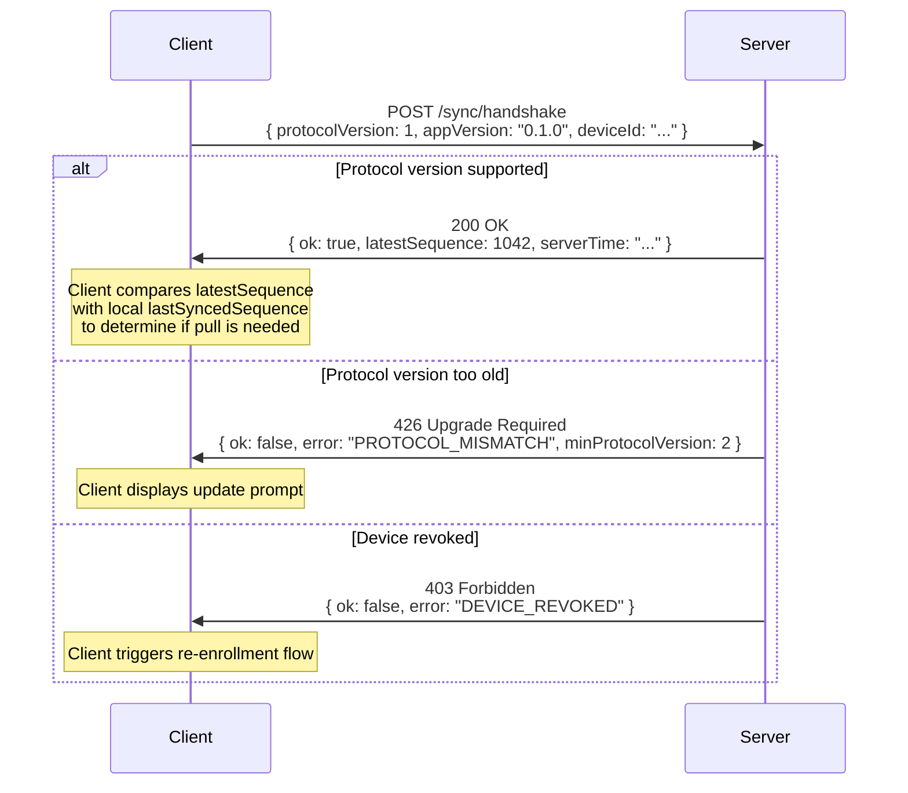

### 3.5 Version Negotiation Rules

1. The server accepts any `protocolVersion` where `minProtocolVersion <= protocolVersion <= maxProtocolVersion`.
2. The negotiated version is `min(clientVersion, maxProtocolVersion)`.
3. If the client version is below `minProtocolVersion`, the server rejects with `PROTOCOL_MISMATCH`.
4. The server MUST support at least versions N and N-1 simultaneously (where N is the latest version).
5. Clients SHOULD upgrade to the latest protocol version within 90 days of a new version release.

---

## 4. REST API Endpoints

All REST endpoints require authentication via a Bearer token (JWT) in the `Authorization` header. All request and response bodies use `application/json` unless otherwise noted. All timestamps are ISO 8601 UTC.

The family context is derived from the authenticated user's family membership. A user belongs to exactly one family in v0.1.

### 4.1 Upload Operations

**Endpoint:** `POST /sync/ops`

Uploads one or more encrypted operations. The server assigns monotonic `globalSequence` numbers in the order the ops appear in the request array. The server validates the per-device hash chain continuity (see Section 6).

**Request body:**

```json
{
  "ops": [
    {
      "deviceId": "550e8400-e29b-41d4-a716-446655440000",
      "deviceSequence": 47,
      "entityType": "CustodySchedule",
      "entityId": "a1b2c3d4-e5f6-7890-abcd-ef1234567890",
      "operation": "CREATE",
      "encryptedPayload": "base64-encoded-encrypted-bytes...",
      "devicePrevHash": "e3b0c44298fc1c149afbf4c8996fb92427ae41e4649b934ca495991b7852b855",
      "currentHash": "a7ffc6f8bf1ed76651c14756a061d662f580ff4de43b49fa82d80a4b80f8434a",
      "keyEpoch": 1,
      "clientTimestamp": "2026-02-20T14:30:00.000Z"
    }
  ]
}
```

| Field | Type | Required | Description |
|-------|------|----------|-------------|
| `ops` | array | yes | Array of 1 to 100 operations |
| `ops[].deviceId` | string (UUID) | yes | Must match the authenticated device |
| `ops[].deviceSequence` | integer | yes | Monotonically increasing per device, starting at 1 |
| `ops[].entityType` | string | yes | One of: `CustodySchedule`, `ScheduleOverride`, `Expense`, `ExpenseStatus` |
| `ops[].entityId` | string (UUID) | yes | The entity this operation targets |
| `ops[].operation` | string | yes | One of: `CREATE`, `UPDATE`, `DELETE` |
| `ops[].encryptedPayload` | string (base64) | yes | The encrypted operation payload |
| `ops[].devicePrevHash` | string (hex, 64 chars) | yes | Hash of the previous op from this device |
| `ops[].currentHash` | string (hex, 64 chars) | yes | `SHA256(devicePrevHash + encryptedPayloadBytes)` |
| `ops[].keyEpoch` | integer | yes | Which DEK version encrypted this payload |
| `ops[].clientTimestamp` | string (ISO 8601) | yes | Client's local time when the op was created |

**Response (Success):**

**HTTP Status:** `201 Created`

```json
{
  "accepted": [
    {
      "deviceSequence": 47,
      "globalSequence": 1043,
      "serverTimestamp": "2026-02-20T14:30:01.123Z"
    }
  ]
}
```

| Field | Type | Description |
|-------|------|-------------|
| `accepted` | array | One entry per accepted op, in the same order as the request |
| `accepted[].deviceSequence` | integer | Echo of the client's device sequence for correlation |
| `accepted[].globalSequence` | integer | Server-assigned global sequence number |
| `accepted[].serverTimestamp` | string (ISO 8601) | Time the server received and persisted the op |

**Response (Partial Failure):**

**HTTP Status:** `207 Multi-Status`

If some ops in the batch are accepted and others rejected, the server returns a `207` with per-op status.

```json
{
  "accepted": [
    {
      "deviceSequence": 47,
      "globalSequence": 1043,
      "serverTimestamp": "2026-02-20T14:30:01.123Z"
    }
  ],
  "rejected": [
    {
      "deviceSequence": 48,
      "error": "HASH_CHAIN_BREAK",
      "message": "Expected devicePrevHash 'abc123...' but got 'def456...'"
    }
  ]
}
```

**Response (Full Failure):**

**HTTP Status:** `400 Bad Request`

```json
{
  "error": "INVALID_REQUEST",
  "message": "ops array must contain between 1 and 100 entries"
}
```

**Server-Side Validation:**

The server performs the following validation on each op. The server MUST reject ops that fail any check.

1. **Authentication:** `deviceId` matches the authenticated device's ID.
2. **Family membership:** The device belongs to the family implied by the endpoint.
3. **Device sequence continuity:** `deviceSequence` equals the last known device sequence + 1. Gaps and duplicates are rejected.
4. **Hash chain continuity:** `devicePrevHash` matches the `currentHash` of the previous op from this device. For the first op from a device, `devicePrevHash` must be `"0000000000000000000000000000000000000000000000000000000000000000"` (64 hex zeros).
5. **Hash correctness:** `currentHash` equals `SHA256(bytes(devicePrevHash) + base64Decode(encryptedPayload))`.
6. **Key epoch validity:** `keyEpoch` is a known, non-revoked epoch for this family.
7. **Entity type validity:** `entityType` is a recognized type for the current protocol version.
8. **Override state transition validation:** For `ScheduleOverride` ops with `operation: "UPDATE"`, the server inspects the `entityType` metadata field and validates the state transition (see Section 9.2). The server does NOT decrypt the payload; it validates based on the unencrypted `operation` field and the most recent known state for that `entityId`.

**Atomicity:**

- If all ops in the batch pass validation, they are all committed atomically with contiguous global sequence numbers.
- If any op fails validation, the server MAY either reject the entire batch (returning `400`) or accept valid ops and reject invalid ones (returning `207`). Implementations SHOULD prefer atomic rejection of the entire batch for simplicity in protocol version 1.
- Clients MUST handle both `400` (full rejection) and `207` (partial) responses.

### 4.2 Pull Operations

**Endpoint:** `GET /sync/ops?since={seq}&limit={n}`

Retrieves operations with `globalSequence > since`, ordered by `globalSequence` ascending.

**Query parameters:**

| Parameter | Type | Required | Default | Description |
|-----------|------|----------|---------|-------------|
| `since` | integer | yes | -- | Return ops with `globalSequence` strictly greater than this value. Use `0` to pull from the beginning. |
| `limit` | integer | no | 100 | Maximum number of ops to return. Range: 1-1000. |

**Response (Success):**

**HTTP Status:** `200 OK`

```json
{
  "ops": [
    {
      "globalSequence": 1043,
      "deviceId": "550e8400-e29b-41d4-a716-446655440000",
      "deviceSequence": 47,
      "entityType": "CustodySchedule",
      "entityId": "a1b2c3d4-e5f6-7890-abcd-ef1234567890",
      "operation": "CREATE",
      "encryptedPayload": "base64-encoded-encrypted-bytes...",
      "devicePrevHash": "e3b0c44298fc1c149afbf4c8996fb92427ae41e4649b934ca495991b7852b855",
      "currentHash": "a7ffc6f8bf1ed76651c14756a061d662f580ff4de43b49fa82d80a4b80f8434a",
      "keyEpoch": 1,
      "clientTimestamp": "2026-02-20T14:30:00.000Z",
      "serverTimestamp": "2026-02-20T14:30:01.123Z"
    }
  ],
  "hasMore": false,
  "latestSequence": 1043
}
```

| Field | Type | Description |
|-------|------|-------------|
| `ops` | array | Ops in `globalSequence` ascending order |
| `hasMore` | boolean | `true` if more ops exist beyond this page |
| `latestSequence` | integer | The highest `globalSequence` for this family (regardless of page) |

**Pagination:**

Clients paginate by setting `since` to the highest `globalSequence` from the previous response:

```
GET /sync/ops?since=0&limit=100       -> ops 1..100, hasMore: true
GET /sync/ops?since=100&limit=100     -> ops 101..200, hasMore: true
GET /sync/ops?since=200&limit=100     -> ops 201..250, hasMore: false
```

Clients MUST continue pulling until `hasMore` is `false` before applying ops to the local database, to ensure they have a complete and ordered set.

### 4.3 Upload Snapshot

**Endpoint:** `POST /sync/snapshot`

Uploads a complete state snapshot. Snapshots are encrypted with the family DEK and signed by the creating device.

**Request body:** `multipart/form-data`

| Part | Content-Type | Description |
|------|-------------|-------------|
| `metadata` | `application/json` | Snapshot metadata (see below) |
| `blob` | `application/octet-stream` | The encrypted snapshot binary |

**Metadata JSON:**

```json
{
  "deviceId": "550e8400-e29b-41d4-a716-446655440000",
  "atSequence": 1043,
  "keyEpoch": 1,
  "sizeBytes": 524288,
  "sha256": "b94d27b9934d3e08a52e52d7da7dabfac484efe37a5380ee9088f7ace2efcde9",
  "signature": "base64-encoded-device-signature...",
  "createdAt": "2026-02-20T15:00:00.000Z"
}
```

| Field | Type | Required | Description |
|-------|------|----------|-------------|
| `deviceId` | string (UUID) | yes | The device that created the snapshot |
| `atSequence` | integer | yes | The global sequence number this snapshot represents state up to (inclusive) |
| `keyEpoch` | integer | yes | The DEK epoch used to encrypt the snapshot |
| `sizeBytes` | integer | yes | Size of the encrypted blob in bytes |
| `sha256` | string (hex, 64 chars) | yes | SHA-256 hash of the encrypted blob |
| `signature` | string (base64) | yes | Ed25519 signature of `SHA256(metadata_canonical_json)` using the device's signing key |
| `createdAt` | string (ISO 8601) | yes | When the snapshot was created |

**Response (Success):**

**HTTP Status:** `201 Created`

```json
{
  "snapshotId": "f47ac10b-58cc-4372-a567-0e02b2c3d479",
  "atSequence": 1043,
  "uploadedAt": "2026-02-20T15:00:01.456Z"
}
```

**Server behavior:**

- The server stores the blob and metadata. It does NOT decrypt or inspect the blob.
- The server retains only the latest snapshot per family (older snapshots MAY be garbage collected).
- Maximum snapshot size: 50 MB.

### 4.4 Get Latest Snapshot

**Endpoint:** `GET /sync/snapshot/latest`

Retrieves metadata for the latest snapshot available for this family, plus a download URL for the encrypted blob.

**Response (Success):**

**HTTP Status:** `200 OK`

```json
{
  "snapshotId": "f47ac10b-58cc-4372-a567-0e02b2c3d479",
  "deviceId": "550e8400-e29b-41d4-a716-446655440000",
  "atSequence": 1043,
  "keyEpoch": 1,
  "sizeBytes": 524288,
  "sha256": "b94d27b9934d3e08a52e52d7da7dabfac484efe37a5380ee9088f7ace2efcde9",
  "signature": "base64-encoded-device-signature...",
  "createdAt": "2026-02-20T15:00:00.000Z",
  "downloadUrl": "/sync/snapshot/f47ac10b-58cc-4372-a567-0e02b2c3d479/blob",
  "downloadUrlExpiresAt": "2026-02-20T16:00:00.000Z"
}
```

| Field | Type | Description |
|-------|------|-------------|
| `downloadUrl` | string | Relative URL to download the encrypted blob. Valid for 1 hour. |
| `downloadUrlExpiresAt` | string (ISO 8601) | Expiry time for the download URL |

**Response (No Snapshot Available):**

**HTTP Status:** `404 Not Found`

```json
{
  "error": "NO_SNAPSHOT",
  "message": "No snapshot has been uploaded for this family"
}
```

### 4.5 Get Server Checkpoint

**Endpoint:** `GET /sync/checkpoint`

Retrieves the latest server checkpoint hash and sequence range. Clients use this to verify integrity of the ops they have received.

**Query parameters:**

| Parameter | Type | Required | Default | Description |
|-----------|------|----------|---------|-------------|
| `atSequence` | integer | no | latest | Request the checkpoint that covers this sequence number. If omitted, returns the most recent checkpoint. |

**Response (Success):**

**HTTP Status:** `200 OK`

```json
{
  "checkpoint": {
    "startSequence": 901,
    "endSequence": 1000,
    "hash": "d7a8fbb307d7809469ca9abcb0082e4f8d5651e46d3cdb762d02d0bf37c9e592",
    "timestamp": "2026-02-20T14:25:00.000Z",
    "opCount": 100
  },
  "latestSequence": 1043,
  "nextCheckpointAt": 1100
}
```

| Field | Type | Description |
|-------|------|-------------|
| `checkpoint.startSequence` | integer | First global sequence in the checkpoint range (inclusive) |
| `checkpoint.endSequence` | integer | Last global sequence in the checkpoint range (inclusive) |
| `checkpoint.hash` | string (hex, 64 chars) | `SHA256(concat(encryptedPayload[start]..encryptedPayload[end]))` |
| `checkpoint.timestamp` | string (ISO 8601) | When the checkpoint was computed |
| `checkpoint.opCount` | integer | Number of ops in the range (should equal `endSequence - startSequence + 1`) |
| `latestSequence` | integer | The current highest global sequence |
| `nextCheckpointAt` | integer | The global sequence at which the next checkpoint will be published |

**Response (No Checkpoints Yet):**

**HTTP Status:** `200 OK`

```json
{
  "checkpoint": null,
  "latestSequence": 42,
  "nextCheckpointAt": 100
}
```

---

## 5. WebSocket Protocol

The WebSocket endpoint provides real-time push notifications to connected clients. It carries **signal messages only** -- no operation data is transmitted over the WebSocket. Clients pull actual data via the REST endpoints described in Section 4.

### 5.1 Connection

**Endpoint:** `wss://{host}/sync/ws`

**Authentication:** The client authenticates via the `Authorization` header during the WebSocket upgrade request, or by sending an `auth` message immediately after connection:

```json
{
  "type": "auth",
  "token": "eyJhbGciOiJFZDI1NTE5..."
}
```

**Server response on successful auth:**

```json
{
  "type": "auth_ok",
  "deviceId": "550e8400-e29b-41d4-a716-446655440000",
  "familyId": "d4e5f6a7-b8c9-0123-4567-890abcdef012",
  "latestSequence": 1043
}
```

**Server response on auth failure:**

```json
{
  "type": "auth_failed",
  "error": "TOKEN_EXPIRED",
  "message": "JWT has expired. Please refresh your token."
}
```

After `auth_failed`, the server closes the WebSocket with close code `4001`.

### 5.2 Subscribe to Family Updates

After authentication, the client is automatically subscribed to updates for their family. No explicit subscribe message is needed. The server associates the WebSocket connection with the authenticated user's family.

### 5.3 Server-to-Client Messages

#### 5.3.1 ops_available

Sent when new operations are available for the client's family. The client SHOULD pull via `GET /sync/ops?since={lastKnownSequence}`.

```json
{
  "type": "ops_available",
  "latestSequence": 1050,
  "sourceDeviceId": "661f9511-f30c-42e5-b827-557766881111"
}
```

| Field | Type | Description |
|-------|------|-------------|
| `type` | string | Always `"ops_available"` |
| `latestSequence` | integer | The highest global sequence now available |
| `sourceDeviceId` | string (UUID) | The device that uploaded the new ops; allows clients to skip pull if the source is themselves |

The server MUST NOT send `ops_available` to the device that uploaded the ops (since it already has them). The server SHOULD coalesce rapid signals: if multiple uploads arrive within 100ms, the server MAY send a single `ops_available` with the final `latestSequence`.

#### 5.3.2 checkpoint_available

Sent when a new server checkpoint has been computed.

```json
{
  "type": "checkpoint_available",
  "startSequence": 1001,
  "endSequence": 1100
}
```

#### 5.3.3 key_rotation

Sent when a key rotation has occurred (device revoked, new DEK epoch).

```json
{
  "type": "key_rotation",
  "newEpoch": 3,
  "revokedDeviceId": "772a0622-a41d-43f6-c938-668877992222"
}
```

The client SHOULD fetch the new wrapped DEK and begin using the new epoch for future ops.

#### 5.3.4 snapshot_available

Sent when a new snapshot has been uploaded.

```json
{
  "type": "snapshot_available",
  "atSequence": 1043,
  "snapshotId": "f47ac10b-58cc-4372-a567-0e02b2c3d479"
}
```

### 5.4 Client-to-Server Messages

#### 5.4.1 ping

Clients SHOULD send periodic pings to keep the connection alive. The server responds with `pong`.

```json
{
  "type": "ping",
  "ts": "2026-02-20T14:30:00.000Z"
}
```

**Server response:**

```json
{
  "type": "pong",
  "ts": "2026-02-20T14:30:00.050Z"
}
```

### 5.5 Connection Lifecycle

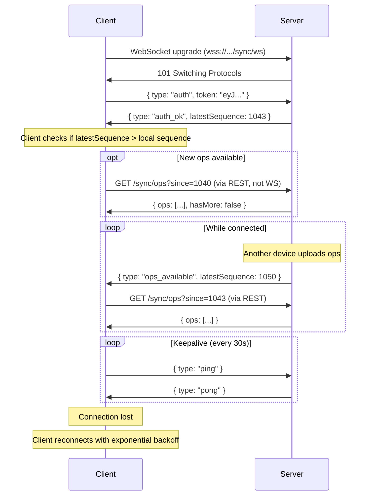

### 5.6 Reconnection Strategy

Clients MUST implement reconnection with exponential backoff:

1. **Initial delay:** 1 second
2. **Backoff multiplier:** 2x
3. **Maximum delay:** 60 seconds
4. **Jitter:** Random 0-500ms added to each delay to prevent thundering herd
5. **Reset:** Backoff resets to initial delay after a successful connection that lasts more than 60 seconds

On reconnection, the client performs a fresh handshake and pulls any ops it missed.

### 5.7 WebSocket Close Codes

| Code | Meaning | Client Action |
|------|---------|---------------|
| 1000 | Normal closure | Reconnect if desired |
| 1001 | Server going away | Reconnect with backoff |
| 4001 | Authentication failed | Refresh JWT, then reconnect |
| 4002 | Device revoked | Trigger re-enrollment flow |
| 4003 | Protocol version unsupported | Display upgrade prompt |
| 4004 | Rate limited | Back off, reconnect after delay |

---

## 6. Per-Device Hash Chains

Each device maintains its own independent hash chain, linking each operation it creates to the previous one. This provides tamper evidence without requiring coordination between offline devices.

### 6.1 Hash Computation

For each operation created by a device, the hash is computed as:

```
currentHash = SHA256(bytes(devicePrevHash) + rawEncryptedPayloadBytes)
```

Where:
- `bytes(devicePrevHash)` is the 32-byte binary representation of the hex-encoded previous hash.
- `rawEncryptedPayloadBytes` is the raw bytes of the encrypted payload (before base64 encoding).
- The `+` operator denotes byte concatenation.

### 6.2 Chain Initialization

The first operation from any device uses a sentinel value for `devicePrevHash`:

```
devicePrevHash = "0000000000000000000000000000000000000000000000000000000000000000"
```

That is, 64 hexadecimal zero characters (representing 32 zero bytes).

### 6.3 Chain Example

```
Device A's chain:

  Op 1 (deviceSeq=1):
    devicePrevHash = "0000...0000"
    encryptedPayload = <bytes_1>
    currentHash = SHA256(bytes("0000...0000") + bytes_1) = "abc1..."

  Op 2 (deviceSeq=2):
    devicePrevHash = "abc1..."
    encryptedPayload = <bytes_2>
    currentHash = SHA256(bytes("abc1...") + bytes_2) = "def2..."

  Op 3 (deviceSeq=3):
    devicePrevHash = "def2..."
    encryptedPayload = <bytes_3>
    currentHash = SHA256(bytes("def2...") + bytes_3) = "789a..."
```

### 6.4 Verification Rules

When a client receives ops from a remote device, it MUST verify the per-device hash chain:

1. **Track per-device state.** The client maintains a map of `deviceId -> lastKnownHash` for every device whose ops it has seen.
2. **First op from a new device.** If the client has never seen an op from `deviceId`, it accepts the op if `devicePrevHash` equals the sentinel (`"0000...0000"`).
3. **Subsequent ops.** For each subsequent op from the same device, `devicePrevHash` MUST equal the `currentHash` of the most recent op from that device.
4. **Hash recomputation.** The client recomputes `SHA256(bytes(devicePrevHash) + base64Decode(encryptedPayload))` and verifies it equals `currentHash`.
5. **Chain break.** If verification fails, the client flags a `HASH_CHAIN_BREAK` error (see Section 11).

### 6.5 Ordering Within a Device Chain

Ops from a single device are always ordered by `deviceSequence`. The global sequence may interleave ops from different devices, but within a device, the `deviceSequence` is strictly monotonic.

```
Global view (interleaved):

  globalSeq=1  deviceA:seq=1  hash: 0000->abc1
  globalSeq=2  deviceB:seq=1  hash: 0000->xyz1
  globalSeq=3  deviceA:seq=2  hash: abc1->def2
  globalSeq=4  deviceB:seq=2  hash: xyz1->uvw2
  globalSeq=5  deviceA:seq=3  hash: def2->789a
```

Each device's chain is independently verifiable regardless of interleaving.

### 6.6 Device Hash Chain Sequence Diagram

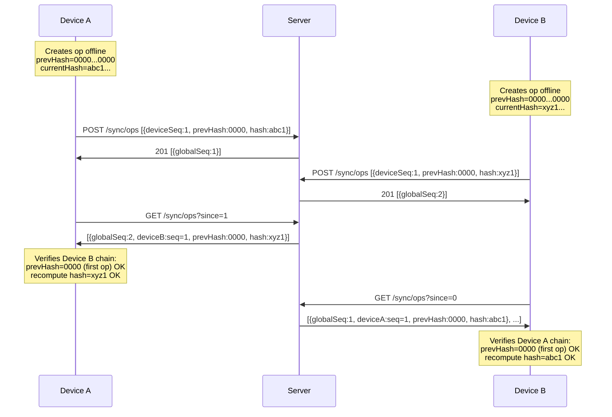

---

## 7. Server Checkpoint Hashes

The server periodically computes a checkpoint hash over a range of operations. Checkpoints provide a server-attested integrity marker that clients can verify.

### 7.1 Checkpoint Computation

Every 100 operations (by global sequence), the server computes:

```
checkpoint.hash = SHA256(
  encryptedPayload[startSequence] +
  encryptedPayload[startSequence + 1] +
  ... +
  encryptedPayload[endSequence]
)
```

Where:
- `encryptedPayload[N]` is the raw encrypted payload bytes (after base64 decoding) of the op at global sequence N.
- `+` denotes byte concatenation.
- `startSequence` is the first sequence in the checkpoint range.
- `endSequence` is the last sequence in the checkpoint range.

### 7.2 Checkpoint Boundaries

Checkpoints are created at fixed intervals:

| Checkpoint | Start Sequence | End Sequence |
|-----------|---------------|-------------|
| 1 | 1 | 100 |
| 2 | 101 | 200 |
| 3 | 201 | 300 |
| N | (N-1)*100 + 1 | N*100 |

The server creates a checkpoint as soon as the end sequence is reached. There is no checkpoint for partial ranges (i.e., if the family has 250 ops, there are checkpoints for 1-100 and 101-200, but not yet for 201-250).

### 7.3 Client Verification

After a client has downloaded a complete checkpoint range of ops, it SHOULD verify the checkpoint:

1. Collect all `encryptedPayload` values for the range `[startSequence, endSequence]`.
2. Base64-decode each payload to raw bytes.
3. Concatenate them in global sequence order.
4. Compute `SHA256` of the concatenation.
5. Compare with the checkpoint hash from `GET /sync/checkpoint`.

If the hashes match, the client has confidence that:
- The server delivered the same payloads to all clients.
- No payloads were silently modified, dropped, or reordered within the range.

### 7.4 Checkpoint Mismatch

If a checkpoint hash does not match the client's computation:

1. The client flags a `CHECKPOINT_MISMATCH` error.
2. The client SHOULD re-download all ops in the affected range from the server.
3. If the mismatch persists after re-download, the client SHOULD alert the user and refuse to apply ops from the affected range.
4. In a self-hosted scenario, this may indicate server storage corruption. In a managed scenario, this is a critical security event.

### 7.5 Checkpoint Retention

The server MUST retain all checkpoints indefinitely (they are small: ~150 bytes each). Checkpoints are part of the integrity audit trail.

---

## 8. Canonical Linearization

The server establishes a single canonical ordering for all operations within a family. This ordering is the authoritative sequence that all clients use to apply operations.

### 8.1 Global Sequence Assignment

1. The server assigns `globalSequence` numbers in the order it receives and persists operations.
2. Global sequence numbers are monotonically increasing integers, starting at 1, with no gaps.
3. Within a single `POST /sync/ops` request containing multiple ops, the ops are assigned contiguous sequence numbers in the order they appear in the request array.
4. Concurrent requests from different devices are serialized by the server (one at a time). The server's internal write lock determines ordering.

### 8.2 Handling Concurrent Offline Operations

When two devices create operations offline and later upload them:

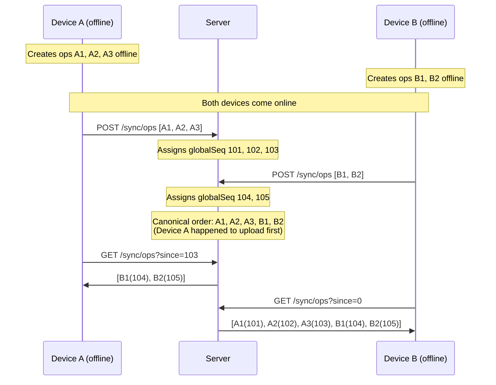

The ordering is determined purely by arrival time at the server. This is intentional: the server provides a consistent total order that all clients observe, even though the "true" causal order may differ.

### 8.3 Client-Side Application Order

Clients MUST apply ops in `globalSequence` order, regardless of `clientTimestamp` or `deviceSequence`. This ensures all clients arrive at the same state through deterministic replay.

**Algorithm:**

```
1. Pull all new ops since lastSyncedSequence
2. Sort by globalSequence ascending (server already returns them sorted)
3. For each op in order:
   a. Verify per-device hash chain (Section 6)
   b. Decrypt encryptedPayload using the key from keyEpoch
   c. Deserialize the operation payload
   d. Apply conflict resolution rules (Section 9)
   e. Update local database
   f. Update lastSyncedSequence
4. If a checkpoint boundary was crossed, verify checkpoint (Section 7)
```

### 8.4 Idempotency

Clients MUST handle receiving the same op twice (e.g., due to network retries or re-download after error). Each op is uniquely identified by `(deviceId, deviceSequence)`. If the client has already applied an op with that identity, it MUST skip it silently.

---

## 9. Conflict Resolution Per Entity

All conflict resolution is deterministic: given the same set of operations in the same order, every client MUST arrive at the same state. The rules below define how conflicts are resolved for each entity type.

### 9.1 CustodySchedule

**Strategy:** Latest `effectiveFrom` wins.

A `CustodySchedule` defines the base custody pattern. Only one schedule can be active per child at any time. When a new schedule is created with a later `effectiveFrom`, it supersedes the previous schedule.

**Resolution algorithm:**

For a given `childId`, when applying a `CustodySchedule` CREATE or UPDATE op:

1. Compare the new schedule's `effectiveFrom` with the current active schedule's `effectiveFrom`.
2. **If new `effectiveFrom` is strictly later:** The new schedule becomes active. The old schedule's `effectiveUntil` is set to the new schedule's `effectiveFrom`.
3. **If `effectiveFrom` values are equal (tie):** Break tie by `clientTimestamp` (later timestamp wins).
4. **If `clientTimestamp` values are also equal (second tie):** Break tie by `deviceId` lexicographic comparison (higher `deviceId` string wins).
5. **If the new schedule loses:** It is stored but marked as superseded. It does NOT become the active schedule.

**Example:**

```
Op at globalSeq=50:
  CustodySchedule CREATE
  childId: "child-1"
  effectiveFrom: "2026-03-01T00:00:00Z"
  deviceId: "device-A"
  clientTimestamp: "2026-02-20T10:00:00Z"

Op at globalSeq=55:
  CustodySchedule CREATE
  childId: "child-1"
  effectiveFrom: "2026-03-01T00:00:00Z"   <-- same effectiveFrom (tie!)
  deviceId: "device-B"
  clientTimestamp: "2026-02-20T10:05:00Z"  <-- later timestamp, wins tie

Result: Device B's schedule is active for child-1 starting 2026-03-01.
        Device A's schedule is superseded.
```

### 9.2 ScheduleOverride

**Strategy:** State machine with authority constraints.

`ScheduleOverride` entities (swap requests, holiday rules, manual overrides) follow a strict state machine. Both clients and the server validate transitions.

#### 9.2.1 State Machine

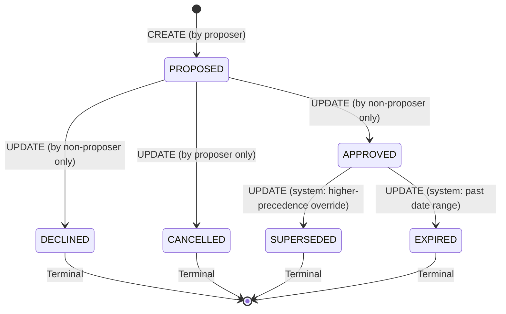

#### 9.2.2 Transition Rules

| From State | To State | Who May Perform | Condition |
|-----------|----------|----------------|-----------|
| (none) | PROPOSED | Any parent | CREATE op |
| PROPOSED | APPROVED | Non-proposer only | The parent who did NOT create the override |
| PROPOSED | DECLINED | Non-proposer only | The parent who did NOT create the override |
| PROPOSED | CANCELLED | Proposer only | The parent who created the override |
| APPROVED | SUPERSEDED | System | A higher-precedence override now covers the same date range |
| APPROVED | EXPIRED | System | The override's date range is entirely in the past |

Terminal states (`DECLINED`, `CANCELLED`, `SUPERSEDED`, `EXPIRED`) are immutable. Any op attempting to transition from a terminal state is rejected.

#### 9.2.3 Server-Side Validation

The server validates state transitions WITHOUT decrypting payloads. It uses metadata available in the unencrypted op envelope:

1. **entityId:** Identifies the ScheduleOverride being modified.
2. **operation:** `CREATE` or `UPDATE`.
3. **deviceId:** Identifies who is performing the action.

The server maintains a lightweight state table:

```
override_states:
  entityId -> { currentState, proposerDeviceUserId }
```

When a `ScheduleOverride` `UPDATE` op arrives:

1. Look up the current state for `entityId`.
2. Determine the acting user from `deviceId` -> `userId` mapping.
3. Determine if the acting user is the proposer or the non-proposer.
4. Validate that the transition is allowed per the table above.
5. If invalid, reject the op with error `INVALID_STATE_TRANSITION`.

**Important:** The server validates based on the `entityType` field (which is unencrypted metadata in the op envelope) and the tracked state. The actual status value is inside the encrypted payload; the server infers the intended transition from the sequence of operations on the same `entityId`.

To enable server-side validation without decryption, the op envelope includes an additional unencrypted field for ScheduleOverride UPDATE operations:

```json
{
  "entityType": "ScheduleOverride",
  "operation": "UPDATE",
  "transitionTo": "APPROVED",
  ...
}
```

| Field | Type | Required | Description |
|-------|------|----------|-------------|
| `transitionTo` | string | Required for ScheduleOverride UPDATE ops | The target state: `APPROVED`, `DECLINED`, `CANCELLED`, `SUPERSEDED`, `EXPIRED` |

The server validates that the transition from the current stored state to `transitionTo` is valid for the acting user.

#### 9.2.4 Concurrent Conflicting Transitions

If two devices submit conflicting transitions for the same override (e.g., Device A sends APPROVED while Device B sends DECLINED):

1. The server processes them in arrival order.
2. The first transition is accepted (e.g., PROPOSED -> APPROVED).
3. The second transition is rejected because the state is no longer PROPOSED (it is now APPROVED, and APPROVED -> DECLINED is not a valid transition).
4. The second device receives a rejection error and must re-sync to discover the current state.

### 9.3 Expense

**Strategy:** Append-only. No conflicts.

Each `Expense` is a distinct, immutable record. Creating an expense never conflicts with another expense. There is no UPDATE operation for expenses.

- `CREATE`: Always succeeds. Each expense has a unique `entityId`.
- `UPDATE`: Not supported. To correct an expense, create a new one and reference the old one.
- `DELETE`: Not supported. Expenses are permanent records (soft-delete only in v1.0 audit trail).

### 9.4 ExpenseStatus

**Strategy:** Last-write-wins by timestamp, with deviceId tie-break.

`ExpenseStatus` tracks the acknowledgment state of an expense (LOGGED -> ACKNOWLEDGED or DISPUTED).

**Resolution algorithm:**

When multiple `ExpenseStatus` UPDATE ops target the same `entityId`:

1. The op with the later `clientTimestamp` wins.
2. If `clientTimestamp` values are equal, the op with the lexicographically higher `deviceId` wins.
3. The winning status is applied; the losing status is stored but not materialized.

**Example:**

```
Op at globalSeq=60:
  ExpenseStatus UPDATE
  entityId: "expense-1"
  status: ACKNOWLEDGED
  deviceId: "device-A"
  clientTimestamp: "2026-02-20T11:00:00Z"

Op at globalSeq=62:
  ExpenseStatus UPDATE
  entityId: "expense-1"
  status: DISPUTED
  deviceId: "device-B"
  clientTimestamp: "2026-02-20T11:00:05Z"   <-- later, wins

Result: expense-1 status = DISPUTED
```

**Note on ordering vs. timestamp:** The `globalSequence` determines when the op is observed, but the `clientTimestamp` determines which write wins. This means a later-arriving op can override an earlier-arriving op if its timestamp is newer. This is intentional for offline scenarios where device B may have made a decision after device A but uploaded later.

### 9.5 Conflict Resolution Summary Table

| Entity | Strategy | Tie-Break 1 | Tie-Break 2 | Server Validates |
|--------|----------|-------------|-------------|-----------------|
| CustodySchedule | Latest `effectiveFrom` | Latest `clientTimestamp` | Lexicographic `deviceId` (higher wins) | No |
| ScheduleOverride | State machine | N/A (first valid transition wins) | N/A | Yes (`transitionTo` field) |
| Expense | Append-only | N/A | N/A | No |
| ExpenseStatus | Last-write-wins (timestamp) | Lexicographic `deviceId` (higher wins) | N/A | No |

---

## 10. Snapshot Format

Snapshots provide a mechanism for new devices to bootstrap quickly without replaying the entire operation log from the beginning.

### 10.1 When to Create Snapshots

Clients SHOULD create a snapshot when:

1. The number of ops since the last snapshot exceeds 500.
2. A new device is about to join the family (proactive snapshot).
3. The user explicitly requests a backup.

Clients MUST NOT create snapshots more frequently than once per 100 ops (to avoid excessive storage use).

### 10.2 Snapshot Contents

A snapshot is an encrypted blob containing the complete materialized state at a specific `globalSequence`. The plaintext (before encryption) is a JSON document with the following structure:

```json
{
  "schemaVersion": 1,
  "atSequence": 1043,
  "createdBy": "550e8400-e29b-41d4-a716-446655440000",
  "createdAt": "2026-02-20T15:00:00.000Z",
  "familyId": "d4e5f6a7-b8c9-0123-4567-890abcdef012",
  "entities": {
    "custodySchedules": [
      {
        "id": "a1b2c3d4-...",
        "childId": "child-1",
        "startDate": "2026-01-06",
        "cycleDays": 14,
        "pattern": ["parent-a", "parent-a", "parent-b", "parent-b", "parent-a", "parent-a", "parent-a", "parent-b", "parent-b", "parent-a", "parent-a", "parent-b", "parent-b", "parent-b"],
        "effectiveFrom": "2026-01-06T00:00:00Z",
        "effectiveUntil": null,
        "status": "ACTIVE"
      }
    ],
    "scheduleOverrides": [
      {
        "id": "b2c3d4e5-...",
        "scheduleId": "a1b2c3d4-...",
        "dateRange": {
          "start": "2026-03-15",
          "end": "2026-03-16"
        },
        "assignedParent": "parent-b",
        "reason": "SWAP",
        "status": "APPROVED",
        "requestedBy": "member-a",
        "respondedBy": "member-b",
        "createdAt": "2026-02-18T09:00:00Z"
      }
    ],
    "expenses": [
      {
        "id": "c3d4e5f6-...",
        "childId": "child-1",
        "paidBy": "parent-a",
        "amount": "125.50",
        "currency": "EUR",
        "category": "MEDICAL",
        "description": "Pediatrician visit",
        "receiptBlobRef": "blob-ref-123",
        "date": "2026-02-15",
        "splitRatio": 0.5,
        "status": "ACKNOWLEDGED",
        "createdAt": "2026-02-15T16:30:00Z"
      }
    ]
  },
  "deviceHashStates": {
    "550e8400-e29b-41d4-a716-446655440000": {
      "lastDeviceSequence": 47,
      "lastHash": "789a..."
    },
    "661f9511-f30c-42e5-b827-557766881111": {
      "lastDeviceSequence": 22,
      "lastHash": "uvw2..."
    }
  }
}
```

| Field | Type | Description |
|-------|------|-------------|
| `schemaVersion` | integer | Snapshot schema version (for forward compatibility) |
| `atSequence` | integer | The global sequence this snapshot is valid through (inclusive) |
| `createdBy` | string (UUID) | Device ID that created the snapshot |
| `createdAt` | string (ISO 8601) | When the snapshot was created |
| `familyId` | string (UUID) | The family this snapshot belongs to |
| `entities` | object | All current entities in their latest resolved state |
| `deviceHashStates` | object | Per-device hash chain state at the snapshot sequence, keyed by device ID |

### 10.3 Snapshot Signing

The creating device signs the snapshot to provide authenticity:

1. Serialize the snapshot metadata (all fields except the encrypted blob itself) as canonical JSON (sorted keys, no whitespace).
2. Compute `SHA256` of the canonical JSON.
3. Sign the hash with the device's Ed25519 signing key.
4. Include the signature in the upload metadata.

Receiving clients verify the signature against the creating device's known public key. If verification fails, the snapshot is rejected.

### 10.4 New Device Bootstrap

When a new device joins a family, it bootstraps its state as follows:

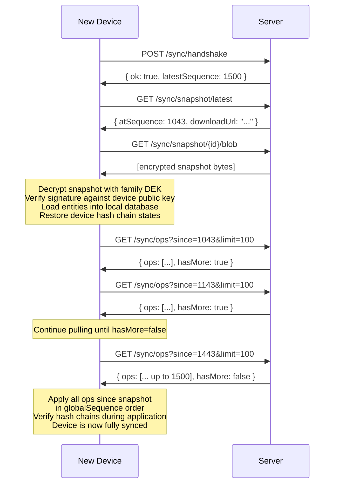

### 10.5 Snapshot Validation

A receiving client validates a snapshot by:

1. **Signature verification:** Verify the Ed25519 signature against the known public key of the creating device.
2. **Hash verification:** Compute SHA-256 of the decrypted snapshot blob and compare with the metadata `sha256` (after decrypting, the plaintext hash should match the content).
3. **Sequence plausibility:** `atSequence` must be less than or equal to the server's current `latestSequence`.
4. **Schema version:** `schemaVersion` must be supported by the client.

If any check fails, the client rejects the snapshot and falls back to full replay from sequence 0.

---

## 11. Error Handling

This section defines how clients and servers handle various error conditions.

### 11.1 Hash Chain Break

**Cause:** A received op's `devicePrevHash` does not match the client's expected value for that device, or the recomputed hash does not match `currentHash`.

**Client recovery procedure:**

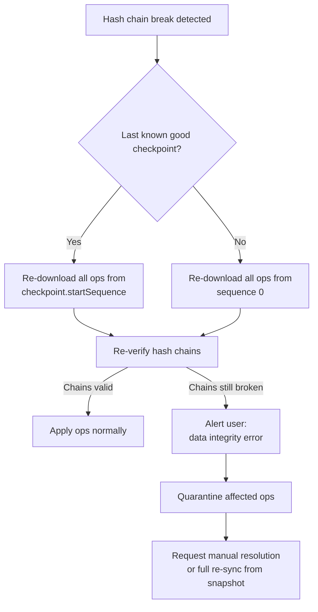

1. Identify the last verified checkpoint before the break.
2. Re-download all ops from that checkpoint's `startSequence`.
3. Re-verify hash chains for the affected device.
4. If chains are now valid (the break was due to a transient download error), continue normally.
5. If chains are still broken after re-download, alert the user and quarantine the affected ops. Do not apply them to the local database.

### 11.2 Checkpoint Mismatch

**Cause:** The client's locally computed checkpoint hash does not match the server's published checkpoint.

**Recovery:**

1. Re-download all ops in the checkpoint range.
2. Recompute the checkpoint hash.
3. If it now matches, the issue was a transient download error.
4. If it still does not match, this indicates server data corruption or tampering.
5. Alert the user. The client SHOULD refuse to process further ops until the issue is resolved.

### 11.3 Protocol Mismatch

**Cause:** Client and server protocol versions are incompatible.

**Server behavior:** Returns HTTP `426 Upgrade Required` with error code `PROTOCOL_MISMATCH`.

**Client behavior:**

1. Display a message to the user indicating an app update is required.
2. If `upgradeUrl` is provided, offer a direct link to the app store.
3. Do NOT attempt to sync. The client continues operating in offline mode with locally available data.

### 11.4 Unknown Operation Type

**Cause:** The client receives an op with an `entityType` it does not recognize (e.g., a newer client created an op type not yet known to this client).

**Client behavior:**

1. **Ignore the op.** Do not attempt to deserialize or apply it.
2. **Preserve it.** Store the raw encrypted op in the local op log for future processing (after the client is updated).
3. **Continue processing.** Do not halt sync. Process all subsequent ops normally.
4. **Log a warning.** Record the unknown entity type for diagnostics.

This provides forward compatibility: older clients can coexist with newer clients that produce new entity types.

### 11.5 Decryption Failure

**Cause:** The client cannot decrypt an op's `encryptedPayload`. Possible reasons:
- The client does not yet have the DEK for the specified `keyEpoch` (key rotation in progress).
- The DEK has been corrupted.
- The payload was encrypted with a different key than indicated.

**Client recovery:**

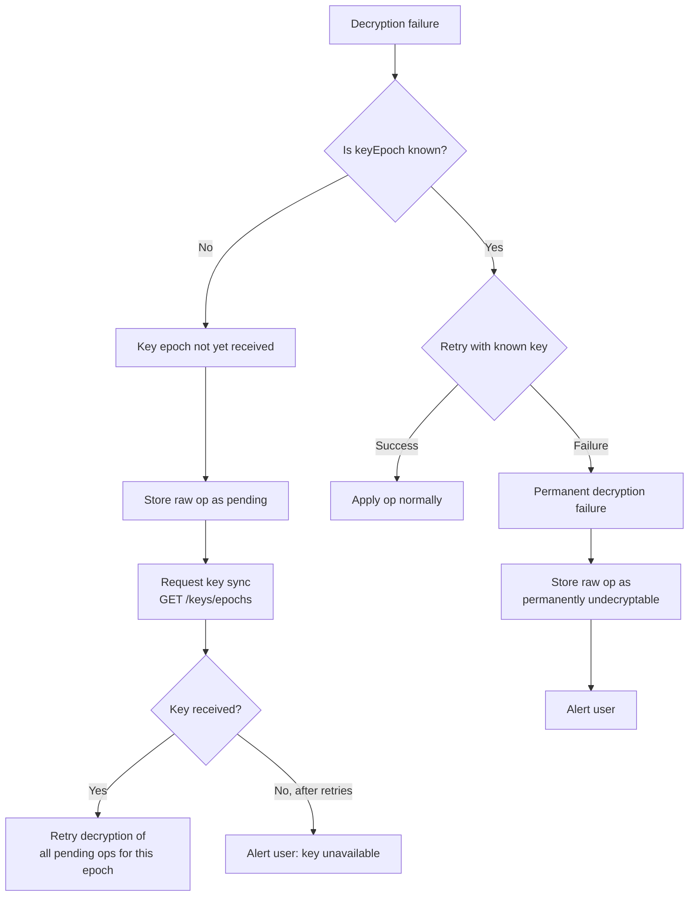

1. **Store the raw op.** Save the encrypted op with a `PENDING_DECRYPTION` status.
2. **Attempt key sync.** If `keyEpoch` is unknown, request the latest key material.
3. **Retry.** After obtaining the key, retry decryption on all pending ops for that epoch.
4. **Permanent failure.** If decryption fails even with the correct epoch key, mark the op as `UNDECRYPTABLE` and alert the user. Do not block sync of other ops.

### 11.6 Network Errors

**Client behavior for transient network errors (timeout, connection reset, 5xx):**

1. Retry with exponential backoff: 1s, 2s, 4s, 8s, 16s, 32s, 60s max.
2. Add random jitter of 0-500ms.
3. After 5 consecutive failures, switch to background periodic retry (every 5 minutes).
4. Show sync status indicator to user (pending/failed).

### 11.7 Rate Limiting

**Server behavior:** Returns HTTP `429 Too Many Requests` with a `Retry-After` header.

```json
{
  "error": "RATE_LIMITED",
  "message": "Too many requests. Please retry after 30 seconds.",
  "retryAfterSeconds": 30
}
```

**Client behavior:** Wait for the duration specified in `Retry-After`, then retry. Do NOT count rate-limiting responses as errors for backoff purposes.

### 11.8 Stale Data Warning

**Cause:** The client's `lastSyncedSequence` is more than 1000 ops behind the server's `latestSequence`, indicating the client has been offline for an extended period.

**Client behavior:**

1. Check if a newer snapshot is available (`GET /sync/snapshot/latest`).
2. If a snapshot exists with `atSequence` closer to `latestSequence`, download and apply the snapshot first, then pull remaining ops.
3. If no suitable snapshot exists, pull ops incrementally (this may take a while).
4. Display a progress indicator to the user during catch-up sync.

---

## 12. Protocol Version Compatibility

### 12.1 Version Support Policy

The server MUST support protocol versions N and N-1 simultaneously, where N is the latest version. When version N+1 is released:

| Version | Status |
|---------|--------|
| N+1 | Current |
| N | Supported |
| N-1 | Deprecated (90-day sunset) |

### 12.2 Version Negotiation Matrix

For protocol version 1 (initial release):

| Client Version | Server Min | Server Max | Result |
|---------------|-----------|-----------|--------|
| 1 | 1 | 1 | OK, use version 1 |
| 1 | 1 | 2 | OK, use version 1 |
| 2 | 1 | 2 | OK, use version 2 |
| 0 | 1 | 2 | Reject: PROTOCOL_MISMATCH |
| 3 | 1 | 2 | Reject: PROTOCOL_MISMATCH (client too new) |

### 12.3 Backward-Compatible Changes

The following changes do NOT require a protocol version bump:

- Adding new optional fields to request/response bodies.
- Adding new `entityType` values (handled by unknown op type rule, Section 11.4).
- Adding new WebSocket message types (unknown types are ignored by clients).
- Adding new error codes.
- Increasing maximum limits (e.g., batch size, page size).

### 12.4 Breaking Changes

The following changes require a protocol version bump:

- Changing the hash computation algorithm.
- Changing the checkpoint interval.
- Removing or renaming existing fields.
- Changing the conflict resolution algorithm for existing entity types.
- Changing the state machine transitions for `ScheduleOverride`.
- Changing the serialization format.

### 12.5 Migration During Version Transition

When the server supports both version N and N-1:

1. Ops uploaded by version N clients include version-specific fields.
2. Ops downloaded by version N-1 clients have version-specific fields stripped.
3. The server translates between versions at the API boundary.
4. The stored op format is always the latest version.
5. Conflict resolution uses the rules of the op's protocol version.

---

## 13. Security Considerations

### 13.1 Server Trust Model

The server is considered **honest-but-curious**:

- It faithfully stores and returns ops in order.
- It may attempt to read payload contents (encryption prevents this).
- It may attempt to correlate metadata (timing, sizes, patterns).

The server is NOT trusted to:

- Preserve data integrity (checkpoints and hash chains verify this).
- Enforce business rules on encrypted data (clients verify this).

The server IS trusted to:

- Assign monotonically increasing sequence numbers without gaps.
- Deliver ops to all family members (availability, not confidentiality).
- Authenticate users and enforce device membership.

### 13.2 Metadata Leakage

The following metadata is visible to the server in plaintext:

| Metadata | Why Visible | Risk |
|----------|------------|------|
| `deviceId` | Routing and hash chain tracking | Links operations to a device |
| `entityType` | Override state machine validation | Reveals what kind of entity changed |
| `entityId` | Override state tracking | Links operations to the same entity |
| `operation` | Override state machine validation | Reveals create/update/delete |
| `transitionTo` | Override state validation | Reveals override status changes |
| `clientTimestamp` | Op metadata | Reveals when the user was active |
| `keyEpoch` | Key management | Reveals key rotation events |
| `encryptedPayload` size | Inherent to storage | May reveal content type by size |

**Mitigations:**
- Payload padding (to nearest 256-byte boundary) to obscure content size.
- `clientTimestamp` may be truncated to minute granularity in future versions.
- `entityId` is a random UUID with no semantic meaning.

### 13.3 Replay Protection

An attacker (or compromised server) cannot replay old ops because:

1. **Device sequence numbers** are strictly monotonic. A replayed op would have a duplicate `deviceSequence`, which is rejected.
2. **Hash chains** would break if an op were inserted or replayed out of order.
3. **Global sequence numbers** are assigned by the server. A client that receives a duplicate global sequence detects the anomaly.

### 13.4 Denial of Service

The server implements rate limiting on all endpoints. Per-device and per-family limits prevent a single compromised device from flooding the system.

| Endpoint | Rate Limit |
|----------|------------|
| `POST /sync/ops` | 60 requests/minute per device |
| `GET /sync/ops` | 120 requests/minute per device |
| `POST /sync/snapshot` | 1 request/hour per device |
| WebSocket messages | 10 messages/second per connection |

### 13.5 Clock Skew

`clientTimestamp` values are set by the device's local clock, which may be inaccurate. The protocol accounts for this:

1. **Conflict resolution** uses `clientTimestamp` only as a tie-breaker, never as a primary ordering mechanism.
2. **Global ordering** is determined by server-assigned sequence numbers (server clock), not client timestamps.
3. The handshake response includes `serverTime`, allowing clients to detect gross clock skew and warn the user.
4. Clients SHOULD warn the user if the device clock differs from the server by more than 5 minutes.

---

## Appendix A: Error Codes

### A.1 Handshake Errors

| Code | HTTP Status | Description |
|------|-----------|-------------|
| `PROTOCOL_MISMATCH` | 426 | Client protocol version is not supported by the server |
| `DEVICE_REVOKED` | 403 | The device has been revoked and must re-enroll |
| `DEVICE_UNKNOWN` | 404 | The device ID is not registered |
| `FAMILY_NOT_FOUND` | 404 | The user is not a member of any family |

### A.2 Sync Errors

| Code | HTTP Status | Description |
|------|-----------|-------------|
| `INVALID_REQUEST` | 400 | Malformed request body or invalid parameters |
| `HASH_CHAIN_BREAK` | 400 | `devicePrevHash` does not match expected value |
| `HASH_MISMATCH` | 400 | Recomputed `currentHash` does not match provided value |
| `SEQUENCE_GAP` | 400 | `deviceSequence` is not contiguous with previous op |
| `SEQUENCE_DUPLICATE` | 409 | `deviceSequence` has already been used by this device |
| `INVALID_KEY_EPOCH` | 400 | `keyEpoch` is not a known epoch for this family |
| `INVALID_ENTITY_TYPE` | 400 | `entityType` is not recognized for this protocol version |
| `INVALID_STATE_TRANSITION` | 409 | ScheduleOverride transition is not valid from current state |
| `TRANSITION_NOT_AUTHORIZED` | 403 | User is not authorized to perform this state transition |
| `BATCH_TOO_LARGE` | 400 | Batch exceeds 100 ops |
| `RATE_LIMITED` | 429 | Too many requests |
| `NO_SNAPSHOT` | 404 | No snapshot available for this family |
| `SNAPSHOT_TOO_LARGE` | 413 | Snapshot exceeds 50 MB |

### A.3 Authentication Errors

| Code | HTTP Status | Description |
|------|-----------|-------------|
| `TOKEN_EXPIRED` | 401 | JWT has expired |
| `TOKEN_INVALID` | 401 | JWT is malformed or signature is invalid |
| `UNAUTHORIZED` | 401 | No valid authentication provided |
| `FORBIDDEN` | 403 | Authenticated but not authorized for this resource |

### A.4 WebSocket Error Codes

| Code | Close Code | Description |
|------|-----------|-------------|
| `WS_AUTH_FAILED` | 4001 | WebSocket authentication failed |
| `WS_DEVICE_REVOKED` | 4002 | Device was revoked during active connection |
| `WS_PROTOCOL_UNSUPPORTED` | 4003 | Protocol version not supported |
| `WS_RATE_LIMITED` | 4004 | Too many messages |

---

## Appendix B: Complete Sequence Diagrams

### B.1 Full Sync Cycle (Two Devices)

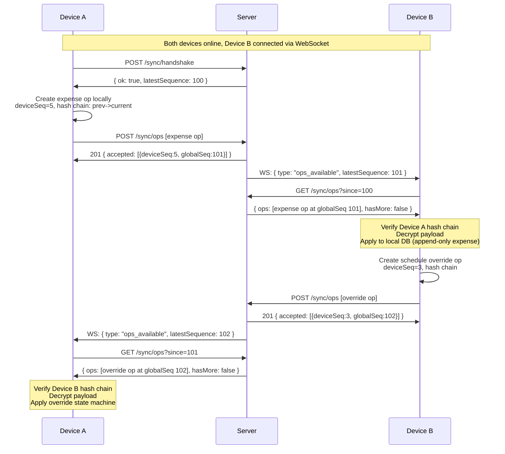

### B.2 Offline Conflict Resolution

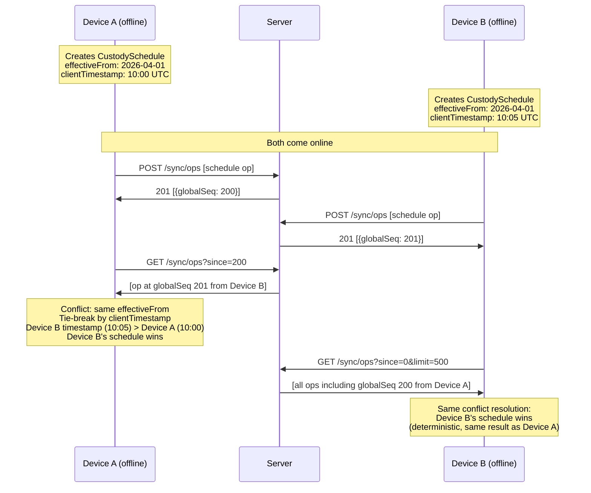

### B.3 Error Recovery (Hash Chain Break)

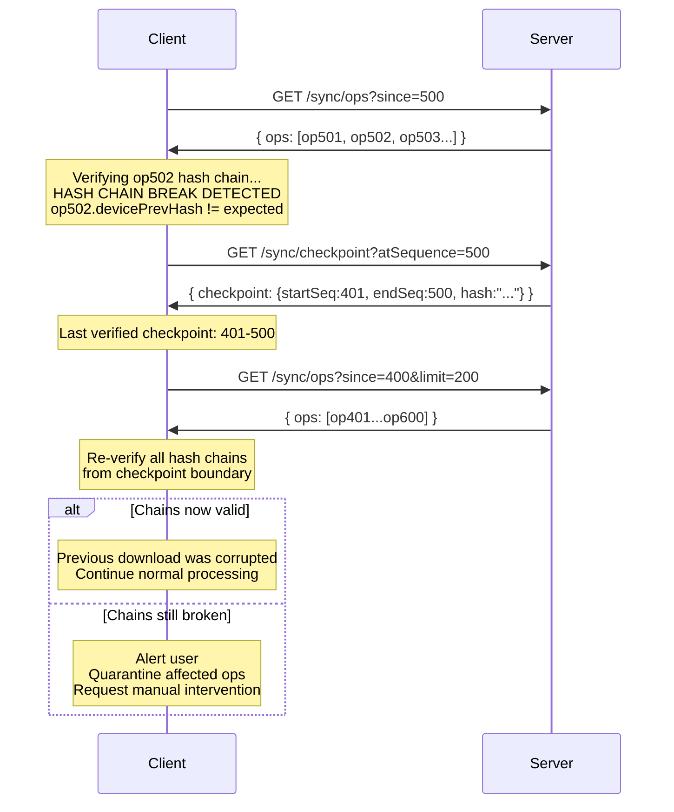

---

## Appendix C: JSON Schema Reference

### C.1 OpLogEntry Envelope (Upload)

```json
{
  "$schema": "https://json-schema.org/draft/2020-12/schema",
  "type": "object",
  "required": [
    "deviceId",
    "deviceSequence",
    "entityType",
    "entityId",
    "operation",
    "encryptedPayload",
    "devicePrevHash",
    "currentHash",
    "keyEpoch",
    "clientTimestamp"
  ],
  "properties": {
    "deviceId": {
      "type": "string",
      "format": "uuid"
    },
    "deviceSequence": {
      "type": "integer",
      "minimum": 1
    },
    "entityType": {
      "type": "string",
      "enum": ["CustodySchedule", "ScheduleOverride", "Expense", "ExpenseStatus"]
    },
    "entityId": {
      "type": "string",
      "format": "uuid"
    },
    "operation": {
      "type": "string",
      "enum": ["CREATE", "UPDATE", "DELETE"]
    },
    "encryptedPayload": {
      "type": "string",
      "contentEncoding": "base64"
    },
    "devicePrevHash": {
      "type": "string",
      "pattern": "^[0-9a-f]{64}$"
    },
    "currentHash": {
      "type": "string",
      "pattern": "^[0-9a-f]{64}$"
    },
    "keyEpoch": {
      "type": "integer",
      "minimum": 1
    },
    "clientTimestamp": {
      "type": "string",
      "format": "date-time"
    },
    "transitionTo": {
      "type": "string",
      "enum": ["APPROVED", "DECLINED", "CANCELLED", "SUPERSEDED", "EXPIRED"],
      "description": "Required for ScheduleOverride UPDATE ops only"
    }
  },
  "if": {
    "properties": {
      "entityType": { "const": "ScheduleOverride" },
      "operation": { "const": "UPDATE" }
    },
    "required": ["entityType", "operation"]
  },
  "then": {
    "required": ["transitionTo"]
  }
}
```

### C.2 Sync Pull Response

```json
{
  "$schema": "https://json-schema.org/draft/2020-12/schema",
  "type": "object",
  "required": ["ops", "hasMore", "latestSequence"],
  "properties": {
    "ops": {
      "type": "array",
      "items": {
        "type": "object",
        "required": [
          "globalSequence",
          "deviceId",
          "deviceSequence",
          "entityType",
          "entityId",
          "operation",
          "encryptedPayload",
          "devicePrevHash",
          "currentHash",
          "keyEpoch",
          "clientTimestamp",
          "serverTimestamp"
        ],
        "properties": {
          "globalSequence": { "type": "integer", "minimum": 1 },
          "deviceId": { "type": "string", "format": "uuid" },
          "deviceSequence": { "type": "integer", "minimum": 1 },
          "entityType": { "type": "string" },
          "entityId": { "type": "string", "format": "uuid" },
          "operation": { "type": "string", "enum": ["CREATE", "UPDATE", "DELETE"] },
          "encryptedPayload": { "type": "string", "contentEncoding": "base64" },
          "devicePrevHash": { "type": "string", "pattern": "^[0-9a-f]{64}$" },
          "currentHash": { "type": "string", "pattern": "^[0-9a-f]{64}$" },
          "keyEpoch": { "type": "integer", "minimum": 1 },
          "clientTimestamp": { "type": "string", "format": "date-time" },
          "serverTimestamp": { "type": "string", "format": "date-time" },
          "transitionTo": { "type": "string" }
        }
      }
    },
    "hasMore": { "type": "boolean" },
    "latestSequence": { "type": "integer", "minimum": 0 }
  }
}
```

### C.3 Checkpoint Response

```json
{
  "$schema": "https://json-schema.org/draft/2020-12/schema",
  "type": "object",
  "required": ["checkpoint", "latestSequence", "nextCheckpointAt"],
  "properties": {
    "checkpoint": {
      "oneOf": [
        { "type": "null" },
        {
          "type": "object",
          "required": ["startSequence", "endSequence", "hash", "timestamp", "opCount"],
          "properties": {
            "startSequence": { "type": "integer", "minimum": 1 },
            "endSequence": { "type": "integer", "minimum": 1 },
            "hash": { "type": "string", "pattern": "^[0-9a-f]{64}$" },
            "timestamp": { "type": "string", "format": "date-time" },
            "opCount": { "type": "integer", "minimum": 1 }
          }
        }
      ]
    },
    "latestSequence": { "type": "integer", "minimum": 0 },
    "nextCheckpointAt": { "type": "integer", "minimum": 1 }
  }
}
```

### C.4 Snapshot Metadata

```json
{
  "$schema": "https://json-schema.org/draft/2020-12/schema",
  "type": "object",
  "required": [
    "deviceId",
    "atSequence",
    "keyEpoch",
    "sizeBytes",
    "sha256",
    "signature",
    "createdAt"
  ],
  "properties": {
    "deviceId": { "type": "string", "format": "uuid" },
    "atSequence": { "type": "integer", "minimum": 1 },
    "keyEpoch": { "type": "integer", "minimum": 1 },
    "sizeBytes": { "type": "integer", "minimum": 1, "maximum": 52428800 },
    "sha256": { "type": "string", "pattern": "^[0-9a-f]{64}$" },
    "signature": { "type": "string", "contentEncoding": "base64" },
    "createdAt": { "type": "string", "format": "date-time" }
  }
}
```

### C.5 WebSocket Messages

```json
{
  "$schema": "https://json-schema.org/draft/2020-12/schema",
  "oneOf": [
    {
      "type": "object",
      "required": ["type", "token"],
      "properties": {
        "type": { "const": "auth" },
        "token": { "type": "string" }
      },
      "additionalProperties": false
    },
    {
      "type": "object",
      "required": ["type"],
      "properties": {
        "type": { "const": "ping" },
        "ts": { "type": "string", "format": "date-time" }
      },
      "additionalProperties": false
    },
    {
      "type": "object",
      "required": ["type", "latestSequence"],
      "properties": {
        "type": { "const": "ops_available" },
        "latestSequence": { "type": "integer" },
        "sourceDeviceId": { "type": "string", "format": "uuid" }
      },
      "additionalProperties": false
    },
    {
      "type": "object",
      "required": ["type", "startSequence", "endSequence"],
      "properties": {
        "type": { "const": "checkpoint_available" },
        "startSequence": { "type": "integer" },
        "endSequence": { "type": "integer" }
      },
      "additionalProperties": false
    },
    {
      "type": "object",
      "required": ["type", "newEpoch"],
      "properties": {
        "type": { "const": "key_rotation" },
        "newEpoch": { "type": "integer" },
        "revokedDeviceId": { "type": "string", "format": "uuid" }
      },
      "additionalProperties": false
    },
    {
      "type": "object",
      "required": ["type", "atSequence", "snapshotId"],
      "properties": {
        "type": { "const": "snapshot_available" },
        "atSequence": { "type": "integer" },
        "snapshotId": { "type": "string", "format": "uuid" }
      },
      "additionalProperties": false
    },
    {
      "type": "object",
      "required": ["type"],
      "properties": {
        "type": { "const": "auth_ok" },
        "deviceId": { "type": "string", "format": "uuid" },
        "familyId": { "type": "string", "format": "uuid" },
        "latestSequence": { "type": "integer" }
      },
      "additionalProperties": false
    },
    {
      "type": "object",
      "required": ["type", "error"],
      "properties": {
        "type": { "const": "auth_failed" },
        "error": { "type": "string" },
        "message": { "type": "string" }
      },
      "additionalProperties": false
    },
    {
      "type": "object",
      "required": ["type"],
      "properties": {
        "type": { "const": "pong" },
        "ts": { "type": "string", "format": "date-time" }
      },
      "additionalProperties": false
    }
  ]
}
```

---

## Document History

| Version | Date | Author | Changes |
|---------|------|--------|---------|
| 1.0.0 | 2026-02-20 | -- | Initial draft covering all Phase 1.2 requirements |
