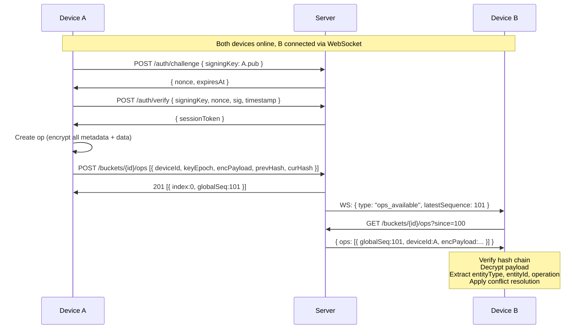
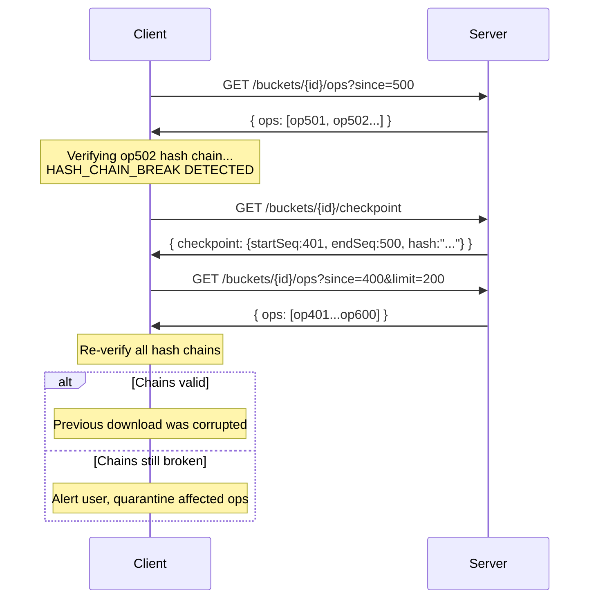

# Sync Protocol Specification

**Protocol Version:** 2
**Document Version:** 2.0.0
**Date:** 2026-02-21
**Status:** Draft (zero-knowledge architecture)
**Prerequisites:** Zero-Knowledge Design Document (2026-02-21)

---

## Table of Contents

1. [Overview](#1-overview)
2. [Terminology](#2-terminology)
3. [Identity and Authentication](#3-identity-and-authentication)
4. [Bucket-Based Storage](#4-bucket-based-storage)
5. [Pairing Flow (QR Code)](#5-pairing-flow-qr-code)
6. [Key Transparency and Cross-Signing](#6-key-transparency-and-cross-signing)
7. [REST API Endpoints](#7-rest-api-endpoints)
8. [WebSocket Protocol](#8-websocket-protocol)
9. [Per-Device Hash Chains](#9-per-device-hash-chains)
10. [Server Checkpoint Hashes](#10-server-checkpoint-hashes)
11. [Canonical Linearization](#11-canonical-linearization)
12. [Client-Side Conflict Resolution](#12-client-side-conflict-resolution)
13. [Client-Side Override State Machine](#13-client-side-override-state-machine)
14. [Snapshot Format](#14-snapshot-format)
15. [Error Handling](#15-error-handling)
16. [Protocol Version Compatibility](#16-protocol-version-compatibility)
17. [Security Considerations](#17-security-considerations)
18. [Appendix A: Error Codes](#appendix-a-error-codes)
19. [Appendix B: Complete Sequence Diagrams](#appendix-b-complete-sequence-diagrams)
20. [Appendix C: JSON Schema Reference](#appendix-c-json-schema-reference)

---

## 1. Overview

This document specifies the synchronization protocol for KidSync, a zero-knowledge co-parenting application. The protocol enables multiple client devices to exchange encrypted operations through a relay server that has no access to plaintext data, no knowledge of user identities, and no visibility into the structure or content of the data being synchronized.

### 1.1 Design Principles

1. **Server sees nothing.** The server stores encrypted blobs and assigns monotonic sequence numbers. It never decrypts payloads. It does not know entity types, operation types, user identities, relationships, or timestamps.
2. **Public key = identity.** There are no accounts, usernames, emails, or passwords on the server. Each device is identified solely by its Ed25519 signing public key.
3. **Client controls everything.** Pairing, conflict resolution, state machines, and all business logic are client-side operations.
4. **All metadata inside encrypted payload.** The server-visible op envelope contains only: deviceId, keyEpoch, encryptedPayload, prevHash, and currentHash. Entity types, entity IDs, operation types, and client timestamps are inside the encrypted payload.
5. **Append-only operation log.** Every mutation is an immutable encrypted op. No entries are ever modified or deleted.
6. **Offline-first.** Clients create operations locally and queue them for upload when connectivity is available.
7. **Tamper-evident.** Per-device hash chains and server checkpoint hashes provide integrity guarantees.
8. **Self-revoke only.** A device can only remove itself from a bucket. Admin revocation is a client-side concept implemented via signed ops inside the encrypted payload.

### 1.2 Protocol Scope

This specification covers:
- Ed25519 challenge-response authentication
- Bucket-based storage model and access control
- QR code pairing flow (no DEK in QR)
- Key transparency and cross-signing
- Operation ordering and linearization
- Hash chain integrity verification
- Client-side conflict resolution (all entity types)
- Client-side override state machine
- Snapshot creation and bootstrapping
- Error handling and recovery procedures

This specification does NOT cover:
- Encryption key management (see `encryption-spec.md`)
- Wire format and serialization (see `wire-format.md`)
- HTTP-level contract details (see `openapi.yaml`)

### 1.3 Relationship to Other Specifications

```
encryption-spec.md    wire-format.md    sync-protocol.md (this document)
       |                    |                    |
       v                    v                    v
  Key management      Serialization       Sync behavior
  Ed25519/X25519      JSON schemas        Authentication
  DEK wrapping        Field ordering      Pairing flow
  Challenge-response  Envelope format     Conflict resolution
  Key attestation                         State machines
       |                    |                    |
       +--------------------+--------------------+
                            |
                            v
                      openapi.yaml
                   (HTTP-level contract)
```

---

## 2. Terminology

| Term | Definition |
|------|-----------|
| **Op** | A single immutable operation in the log, representing one mutation to one entity |
| **OpInput** | The minimal encrypted envelope sent from client to server: deviceId, keyEpoch, encryptedPayload, prevHash, currentHash |
| **DecryptedPayload** | The plaintext content inside encryptedPayload, containing all metadata and business data |
| **Bucket** | An anonymous, opaque storage namespace replacing the concept of families. The server does not know what a bucket represents |
| **Global Sequence** | Server-assigned monotonic integer, unique per bucket, incrementing by 1 |
| **Device Sequence** | Per-device monotonic counter inside the encrypted payload, tracking how many ops a device has created |
| **Device Hash Chain** | Per-device SHA-256 chain linking each op to its predecessor from the same device |
| **Checkpoint** | Server-computed hash over a range of encrypted payloads for integrity verification |
| **Snapshot** | Complete serialized application state at a specific global sequence number, encrypted and signed |
| **DEK** | Data Encryption Key; the symmetric key encrypting all ops within a bucket |
| **Key Epoch** | Monotonic version number for the bucket DEK; incremented on key rotation |
| **Relay** | The server, emphasizing that it only stores and forwards encrypted data |
| **Session Token** | Server-signed opaque token (not JWT) containing only deviceId, signingKey, and expiry. No user ID, no bucket IDs |
| **Signing Key** | Ed25519 public key used as the device's identity and for challenge-response authentication |
| **Encryption Key** | X25519 public key used for DEK wrapping via ECDH |
| **Key Attestation** | An Ed25519 signature by one device over another device's encryption key, proving it was verified out-of-band |

---

## 3. Identity and Authentication

### 3.1 Device Identity

Each device generates two keypairs at first launch:

| Purpose | Algorithm | Storage |
|---------|-----------|---------|
| Signing / Authentication | Ed25519 | Android Keystore / iOS Secure Enclave |
| Encryption / DEK wrapping | X25519 | Derived from Ed25519 seed via `crypto_sign_ed25519_sk_to_curve25519` |

Both keypairs are derived from a single 32-byte seed stored once in hardware-backed secure storage. The server knows only the public halves and a server-assigned deviceId UUID.

### 3.2 Registration

A device registers by presenting its public keys. No email, no password, no name.

```
Client                              Server
  |                                   |
  |  POST /register                   |
  |  { signingKey: Ed25519_pub,       |
  |    encryptionKey: X25519_pub }    |
  | --------------------------------> |
  |                                   |  Verify signingKey not already registered
  |                                   |  Store keys in devices table
  |  201 { deviceId: UUID }           |  (no email, no name, no user concept)
  | <-------------------------------- |
```

The server stores:
- `devices.id`: server-assigned UUID
- `devices.signing_key`: Ed25519 public key (unique constraint)
- `devices.encryption_key`: X25519 public key
- `devices.created_at`: server timestamp

Nothing else. The server does not know who this device belongs to or what it will be used for.

### 3.3 Challenge-Response Authentication

Each session begins with a two-step challenge-response exchange. There are no passwords, no JWTs, no refresh tokens.

```
Client                              Server
  |                                   |
  |  POST /auth/challenge             |
  |  { signingKey: Ed25519_pub }      |
  | --------------------------------> |
  |                                   |  Look up device by signingKey
  |                                   |  Generate 32-byte random nonce
  |                                   |  Store nonce with 60s TTL
  |                                   |  Mark nonce as one-time-use
  |  200 { nonce, expiresAt }         |
  | <-------------------------------- |
  |                                   |
  |  Construct challenge message:     |
  |    msg = nonce (32 bytes)         |
  |        || signingKey (32 bytes)   |
  |        || serverOrigin (UTF-8)    |
  |        || timestamp (UTF-8)       |
  |  sig = Ed25519_sign(privKey, msg) |
  |                                   |
  |  POST /auth/verify                |
  |  { signingKey, nonce, timestamp,  |
  |    signature }                    |
  | --------------------------------> |
  |                                   |  Verify nonce exists and is unused
  |                                   |  Verify nonce has not expired (60s TTL)
  |                                   |  Consume nonce (delete from store)
  |                                   |  Reconstruct msg from components
  |                                   |  Verify Ed25519 signature
  |                                   |  Verify timestamp within 60s of server time
  |  200 { sessionToken, expiresIn }  |  Issue opaque session token
  | <-------------------------------- |
```

### 3.4 Anti-Replay Protections

The challenge-response protocol provides the following anti-replay guarantees:

1. **Nonces are one-time-use.** The server deletes the nonce from its store upon successful verification. A replayed verify request with the same nonce fails because the nonce no longer exists.
2. **60-second nonce TTL.** Nonces expire 60 seconds after creation. A delayed replay attempt fails because the nonce has been garbage-collected.
3. **Challenge message binding.** The signed message includes the signing key, the server's origin URL, and the client's timestamp. This prevents:
   - Cross-device replay (binding to signing key)
   - Cross-server replay (binding to server origin)
   - Delayed replay (binding to timestamp, verified within 60s of server time)

### 3.5 Session Token

The session token is a server-signed opaque token (not JWT). It contains only:

```
{ deviceId, signingKey, exp }
```

- No user ID (there are no users on the server)
- No bucket IDs (bucket access is checked live per request)
- No email (there are no emails)
- Short-lived: configurable, default 1 hour
- Not refreshable: when expired, the client performs a new challenge-response

The server validates the session token on every authenticated request and performs a live check of `bucket_access` for bucket-scoped operations.

### 3.6 What Disappeared

| Removed Concept | Reason |
|-----------------|--------|
| Email + password registration | No accounts, no passwords |
| BCrypt password hashing | No passwords |
| JWT access tokens | Replaced by opaque session tokens |
| JWT refresh tokens | No refresh flow; re-authenticate via challenge-response |
| TOTP two-factor authentication | No passwords to protect; key-based auth is inherently strong |
| `Users` table | No user concept on server |
| `RefreshTokens` table | No refresh tokens |
| `AuthService.kt` | Replaced by challenge-response handler |

---

## 4. Bucket-Based Storage

### 4.1 Bucket Concept

A **bucket** is an anonymous, opaque storage namespace. The server does not know what a bucket represents -- it could be a family, an organization, a personal workspace, or anything else. The server only knows which device public keys have access to which bucket IDs.

### 4.2 Bucket Lifecycle

**Creation:** Any authenticated device can create a bucket. The creating device's ID is recorded in `buckets.created_by` for deletion authorization.

```
POST /buckets
Authorization: Bearer <session-token>

Response: 201 { bucketId: UUID }
```

**Deletion:** Only the creating device can delete a bucket. Deletion purges all ops, blobs, snapshots, checkpoints, and access records.

```
DELETE /buckets/{id}
Authorization: Bearer <session-token>

Response: 204
```

### 4.3 Access Control

The `bucket_access` table tracks which devices have access to which buckets:

| Column | Type | Description |
|--------|------|-------------|
| `bucket_id` | UUID | The bucket |
| `device_id` | UUID | The device with access |
| `granted_at` | datetime | When access was granted |
| `revoked_at` | datetime | When access was revoked (null if active) |

All bucket-scoped endpoints verify that the authenticated device has active (non-revoked) access to the bucket. This is a live check, not embedded in the session token.

### 4.4 Self-Revoke Only Policy

The server enforces a strict self-revoke-only policy for device removal:

- `DELETE /buckets/{id}/devices/me` -- a device can only remove **itself** from a bucket.
- The server verifies `authenticatedDeviceId == the device being removed`.
- There is no server-side concept of admin, owner, or roles.
- There is no endpoint for one device to remove another device.

**Admin revocation** (if needed) is implemented entirely on the client side:
1. An "admin" device publishes a signed revocation op inside the encrypted payload.
2. Other devices observe the revocation op during sync.
3. Remaining devices stop wrapping the DEK for the revoked device's key.
4. Remaining devices rotate the DEK to a new epoch, wrapping only for non-revoked devices.
5. The revoked device can still call `DELETE /buckets/{id}/devices/me` to clean up its server-side access record.

### 4.5 What Disappeared from the Server Schema

| Removed | Reason |
|---------|--------|
| `families.name` | Client-side only concept |
| `families.is_solo` | Client-side concept |
| `family_members.role` | Client-side concept |
| `family_members.user_id` | No users on server |
| `devices.device_name` | Client-side only |
| `ops.entity_type` | Inside encrypted payload |
| `ops.entity_id` | Inside encrypted payload |
| `ops.operation` | Inside encrypted payload |
| `ops.client_timestamp` | Inside encrypted payload |
| `ops.transition_to` | Client-side state machine |
| `ops.protocol_version` | Inside encrypted payload |
| `ops.device_sequence` | Inside encrypted payload |
| `override_states.*` | Client-side state machine |

---

## 5. Pairing Flow (QR Code)

### 5.1 Overview

Two devices connect to the same bucket via a QR code pairing flow. The QR code contains connection info and the initiator's key fingerprint but **never** the DEK. The DEK is exchanged via wrapped key exchange after both devices are authenticated.

### 5.2 Complete Pairing Sequence

```
Device A (initiator)                 Server                    Device B (joiner)
  |                                    |                          |
  |  1. Create bucket                  |                          |
  |  POST /buckets                     |                          |
  | ---------------------------------> |                          |
  |  { bucketId }                      |                          |
  | <--------------------------------- |                          |
  |                                    |                          |
  |  2. Generate invite token locally  |                          |
  |  token = CSRNG(32)                 |                          |
  |  POST /buckets/{id}/invite         |                          |
  |  { tokenHash: SHA256(token) }      |                          |
  | ---------------------------------> |                          |
  |  201 OK                            |                          |
  |                                    |                          |
  |  3. Build QR payload               |                          |
  |  {                                 |                          |
  |    v: 1,                           |                          |
  |    s: "https://api.kidsync.app",   |                          |
  |    b: "bucket-uuid",               |                          |
  |    t: "invite-token-plaintext",    |                          |
  |    f: "SHA256(A.signingKey)"       |                          |
  |  }                                 |                          |
  |  Encode as QR (CBOR + base64url)   |                          |
  |                                    |                          |
  |  4. Display QR ======================> 5. Scan QR             |
  |     (physical proximity             |      Decode payload      |
  |      or secure channel)             |      Store A's key       |
  |                                    |      fingerprint as       |
  |                                    |      trusted anchor       |
  |                                    |                          |
  |                                    |  6. Register device       |
  |                                    |  POST /register           |
  |                                    |  { signingKey, encKey }   |
  |                                    | <------------------------ |
  |                                    |  { deviceId }             |
  |                                    | ------------------------> |
  |                                    |                          |
  |                                    |  7. Authenticate          |
  |                                    |  (challenge-response)     |
  |                                    | <----------------------> |
  |                                    |                          |
  |                                    |  8. Redeem invite         |
  |                                    |  POST /buckets/{id}/join  |
  |                                    |  { inviteToken }          |
  |                                    | <------------------------ |
  |                                    |  Server: hash(token)      |
  |                                    |  matches stored hash?     |
  |                                    |  Grant access, mark used  |
  |                                    | ------------------------> |
  |                                    |                          |
  |  9. Notified (push/WS)            |                          |
  |  "new device joined bucket"       |                          |
  | <--------------------------------- |                          |
  |                                    |                          |
  | 10. Fetch B's key, verify         |                          |
  |  GET /buckets/{id}/devices         |                          |
  | ---------------------------------> |                          |
  |  [{ deviceId: B, encKey: ... }]    |                          |
  | <--------------------------------- |                          |
  |                                    |                          |
  | 11. Cross-sign B's key            |                          |
  |  POST /keys/attestations           |                          |
  |  { attestedDevice: B,              |                          |
  |    attestedKey: B.encKey,          |                          |
  |    signature: sign(B.id||B.encKey)}|                          |
  | ---------------------------------> |                          |
  |                                    |                          |
  | 12. Wrap DEK for B                |                          |
  |  POST /keys/wrapped                |                          |
  |  { targetDevice: B,                |                          |
  |    wrappedDek: ..., epoch: 1 }     |                          |
  | ---------------------------------> |                          |
  |                                    |                          |
  |                                    | 13. B fetches attestation |
  |                                    |  GET /keys/attestations/A |
  |                                    | <------------------------ |
  |                                    |  { signer: A, sig: ... }  |
  |                                    | ------------------------> |
  |                                    |  Verify A's sig using     |
  |                                    |  fingerprint from QR      |
  |                                    |                          |
  |                                    | 14. B fetches wrapped DEK |
  |                                    |  GET /keys/wrapped?epoch=1|
  |                                    | <------------------------ |
  |                                    |  { wrappedDek, epoch }    |
  |                                    | ------------------------> |
  |                                    |  Unwrap with private key  |
  |                                    |  Now can decrypt all ops  |
  |                                    |                          |
  |                                    | 15. B cross-signs A's key |
  |                                    |  POST /keys/attestations  |
  |                                    | <------------------------ |
```

### 5.3 QR Code Contents

```json
{
  "v": 1,
  "s": "https://api.kidsync.app",
  "b": "bucket-uuid",
  "t": "invite-token-plaintext",
  "f": "SHA256-fingerprint-of-device-A-signing-key"
}
```

| Field | Description |
|-------|-------------|
| `v` | QR payload version (currently 1) |
| `s` | Server URL |
| `b` | Bucket UUID |
| `t` | Invite token (plaintext; server stores only SHA-256 hash) |
| `f` | SHA-256 fingerprint of Device A's Ed25519 signing key (first 32 hex chars) |

The payload is compact-encoded (CBOR or MessagePack, then base64url) to keep the QR code small.

### 5.4 Invite Token Properties

- 32 bytes of CSRNG entropy, base64url-encoded (43 characters)
- Server stores only `SHA256(token)` in `invite_tokens` table
- Single-use: marked as used on successful join
- 24-hour expiry
- Rate-limited: maximum 5 active invites per bucket

### 5.5 Security Properties

- **No DEK in QR code.** The DEK is never in the QR code. It is wrapped with Device B's X25519 key and exchanged via the server after join. If the QR image is captured, the attacker gets bucket access but not the DEK (they would need to complete the full pairing flow, and their key fingerprint would not match).
- **Cross-signing.** Device A's signing key fingerprint in the QR code allows Device B to verify that the wrapped DEK actually came from Device A, not from a server performing key substitution.
- **Physical proximity.** QR scanning requires physical proximity or deliberate secure sharing.
- **Server learns nothing.** Server sees "device B joined bucket X" but does not know what the bucket represents or who the devices belong to.

---

## 6. Key Transparency and Cross-Signing

### 6.1 Threat Model

A compromised server could substitute a device's encryption key during the DEK wrapping step, intercepting the DEK. Key attestations prevent this by providing a verifiable chain of trust rooted in the QR code exchange.

### 6.2 Key Attestation Format

A key attestation is an Ed25519 signature by one device over another device's identity and encryption key:

```
signerDeviceId:     UUID of the signing device
attestedDeviceId:   UUID of the device being attested
attestedKey:        X25519 public key being attested (base64)
signature:          Ed25519_sign(signerPrivKey, attestedDeviceId || attestedKey)
```

The `||` operator denotes byte concatenation of the UTF-8 encoded device ID and the raw 32-byte X25519 public key.

### 6.3 Verification Flow

1. During pairing, Device A's signing key fingerprint is embedded in the QR code (trusted out-of-band channel).
2. After Device B joins the bucket, Device A fetches Device B's encryption key from the server.
3. Device A signs an attestation of Device B's encryption key and uploads it.
4. Device B fetches Device A's attestation and verifies it using the signing key fingerprint from the QR code.
5. Device B signs an attestation of Device A's encryption key and uploads it.
6. On subsequent key fetches, any device can verify that keys have not been substituted by checking cross-signatures from at least one trusted device.

### 6.4 Key Change Detection

When a device's encryption key changes (e.g., after recovery with a new device):
- Existing attestations for the old key are invalidated (signature verification will fail against the new key).
- Other devices see unattested keys and prompt the user to verify in-person before wrapping the DEK with the new key.
- This is analogous to Signal's "safety number" change notification.

### 6.5 Trust Model

The trust chain is:
1. QR code (out-of-band, trusted) provides Device A's signing key fingerprint.
2. Device A's attestation of Device B's encryption key is verifiable using the fingerprint.
3. Device B's attestation of Device A's encryption key closes the circle.
4. Any new Device C that pairs with Device A or B transitively trusts the attestation chain.

---

## 7. REST API Endpoints

All REST endpoints (except `/register`, `/auth/challenge`, `/auth/verify`, `/health`) require a valid session token in the `Authorization: Bearer` header.

Bucket-scoped endpoints additionally verify that the authenticated device has active access to the specified bucket via the `bucket_access` table.

All request and response bodies use `application/json` unless otherwise noted. All timestamps are ISO 8601 UTC.

### 7.1 Upload Operations

**Endpoint:** `POST /buckets/{id}/ops`

Uploads one or more encrypted operations. The server assigns monotonic `globalSequence` numbers. The server validates the per-device hash chain continuity.

**Request body:**

```json
{
  "ops": [
    {
      "deviceId": "550e8400-e29b-41d4-a716-446655440000",
      "keyEpoch": 1,
      "encryptedPayload": "base64-encoded-encrypted-bytes...",
      "prevHash": "e3b0c44298fc1c149afbf4c8996fb92427ae41e4649b934ca495991b7852b855",
      "currentHash": "a7ffc6f8bf1ed76651c14756a061d662f580ff4de43b49fa82d80a4b80f8434a"
    }
  ]
}
```

| Field | Type | Required | Description |
|-------|------|----------|-------------|
| `ops` | array | yes | Array of 1 to 100 operations |
| `ops[].deviceId` | string (UUID) | yes | Must match the authenticated device |
| `ops[].keyEpoch` | integer | yes | Which DEK version encrypted this payload |
| `ops[].encryptedPayload` | string (base64) | yes | Opaque encrypted payload containing all metadata and data |
| `ops[].prevHash` | string (hex, 64 chars) | yes | Hash of the previous op from this device |
| `ops[].currentHash` | string (hex, 64 chars) | yes | `SHA256(bytes(prevHash) + base64Decode(encryptedPayload))` |

The server does NOT see: entity types, entity IDs, operation types, client timestamps, device sequence numbers, protocol versions, or any business data. All of these are inside `encryptedPayload`.

**Response (Success): `201 Created`**

```json
{
  "accepted": [
    {
      "index": 0,
      "globalSequence": 1043,
      "serverTimestamp": "2026-02-21T14:30:01.123Z"
    }
  ]
}
```

**Response (Partial Failure): `207 Multi-Status`**

```json
{
  "accepted": [...],
  "rejected": [
    {
      "index": 1,
      "error": "HASH_CHAIN_BREAK",
      "message": "Expected prevHash 'abc123...' but got 'def456...'"
    }
  ]
}
```

**Server-Side Validation:**

The server performs only the following validation (no business logic):

1. **Authentication:** `deviceId` matches the authenticated device.
2. **Bucket access:** The device has active access to this bucket.
3. **Hash chain continuity:** `prevHash` matches the `currentHash` of the previous op from this device. For the first op, `prevHash` must be 64 hex zeros.
4. **Hash correctness:** `currentHash` equals `SHA256(hexDecode(prevHash) + base64Decode(encryptedPayload))`.
5. **Key epoch validity:** `keyEpoch` references a known epoch for this bucket.
6. **Payload size limit:** `encryptedPayload` does not exceed 64 KB (base64-encoded).
7. **Batch size limit:** The batch contains at most 100 ops.

Validation the server does **NOT** perform (moved to client):
- Entity type validation
- Operation type validation
- Override state machine transitions
- Device sequence continuity (inside encrypted payload)
- Client timestamp validation

**Atomicity:** If all ops pass validation, they are committed atomically with contiguous global sequence numbers. If any op fails, the server rejects the entire batch (returning `400`) or accepts valid ops and rejects invalid ones (returning `207`). Clients MUST handle both responses.

### 7.2 Pull Operations

**Endpoint:** `GET /buckets/{id}/ops?since={seq}&limit={n}`

Retrieves operations with `globalSequence > since`, ordered ascending.

**Query parameters:**

| Parameter | Type | Required | Default | Description |
|-----------|------|----------|---------|-------------|
| `since` | integer | yes | -- | Return ops with `globalSequence` strictly greater than this value |
| `limit` | integer | no | 100 | Maximum ops to return (1-1000) |

**Response: `200 OK`**

```json
{
  "ops": [
    {
      "globalSequence": 1043,
      "deviceId": "550e8400-e29b-41d4-a716-446655440000",
      "keyEpoch": 1,
      "encryptedPayload": "base64-encoded-encrypted-bytes...",
      "prevHash": "e3b0c44298fc1c149afbf4c8996fb92427ae41e4649b934ca495991b7852b855",
      "currentHash": "a7ffc6f8bf1ed76651c14756a061d662f580ff4de43b49fa82d80a4b80f8434a",
      "serverTimestamp": "2026-02-21T14:30:01.123Z"
    }
  ],
  "hasMore": false,
  "latestSequence": 1043
}
```

Each op returned contains only: `globalSequence`, `deviceId`, `keyEpoch`, `encryptedPayload`, `prevHash`, `currentHash`, `serverTimestamp`. No entity types, no operation types, no client timestamps.

Clients paginate by setting `since` to the highest `globalSequence` from the previous response. Clients MUST continue pulling until `hasMore` is `false`.

### 7.3 Checkpoint

**Endpoint:** `GET /buckets/{id}/checkpoint`

Returns the latest server checkpoint hash for integrity verification.

**Response: `200 OK`**

```json
{
  "checkpoint": {
    "startSequence": 901,
    "endSequence": 1000,
    "hash": "d7a8fbb307d7809469ca9abcb0082e4f8d5651e46d3cdb762d02d0bf37c9e592",
    "timestamp": "2026-02-21T14:25:00.000Z",
    "opCount": 100
  },
  "latestSequence": 1043,
  "nextCheckpointAt": 1100
}
```

### 7.4 Snapshots

**Upload:** `POST /buckets/{id}/snapshots` (multipart/form-data)
**Download metadata:** `GET /buckets/{id}/snapshots/latest`

See Section 14 for snapshot format details.

### 7.5 Blobs

**Upload:** `POST /buckets/{id}/blobs` (multipart/form-data)
**Download:** `GET /buckets/{id}/blobs/{blobId}` (application/octet-stream)

Blobs are scoped to a bucket, not global. The server stores encrypted bytes and metadata (size, SHA-256 hash) but cannot determine content type or purpose.

### 7.6 Complete Endpoint List

```
POST   /register                        Register device (public keys only)
POST   /auth/challenge                  Request auth nonce
POST   /auth/verify                     Verify signed nonce, get session token

POST   /buckets                         Create anonymous bucket
DELETE /buckets/{id}                    Delete bucket (creator only)
POST   /buckets/{id}/invite             Register invite token hash
POST   /buckets/{id}/join               Redeem invite token
GET    /buckets/{id}/devices            List devices with access
DELETE /buckets/{id}/devices/me         Self-revoke (leave bucket)

POST   /buckets/{id}/ops                Upload encrypted ops
GET    /buckets/{id}/ops?since={seq}    Pull ops since sequence
GET    /buckets/{id}/checkpoint         Get latest checkpoint

POST   /buckets/{id}/blobs              Upload encrypted blob
GET    /buckets/{id}/blobs/{blobId}     Download encrypted blob

POST   /buckets/{id}/snapshots          Upload encrypted snapshot
GET    /buckets/{id}/snapshots/latest   Get latest snapshot metadata

POST   /keys/wrapped                    Upload wrapped DEK
GET    /keys/wrapped?epoch={n}          Get wrapped DEK for authenticated device

POST   /keys/attestations               Upload key cross-signature
GET    /keys/attestations/{deviceId}    Get attestations for a device

POST   /recovery                        Upload encrypted recovery blob
GET    /recovery                        Download encrypted recovery blob

POST   /push/token                      Register push notification token

GET    /health                          Health check (unauthenticated)
```

---

## 8. WebSocket Protocol

The WebSocket endpoint provides real-time push notifications. It carries **signal messages only** -- no operation data is transmitted over the WebSocket.

### 8.1 Connection

**Endpoint:** `wss://{host}/buckets/{id}/ws`

Authentication is via the session token, provided either in the `Authorization` header during the WebSocket upgrade or as the first message after connection:

```json
{
  "type": "auth",
  "token": "opaque-session-token"
}
```

**Server response on success:**

```json
{
  "type": "auth_ok",
  "deviceId": "550e8400-e29b-41d4-a716-446655440000",
  "bucketId": "d4e5f6a7-b8c9-0123-4567-890abcdef012",
  "latestSequence": 1043
}
```

Note: no `familyId`, no user identity. The server knows only the device ID and bucket ID.

**Server response on failure:**

```json
{
  "type": "auth_failed",
  "error": "TOKEN_EXPIRED",
  "message": "Session token has expired. Please re-authenticate."
}
```

After `auth_failed`, the server closes the WebSocket with close code `4001`.

### 8.2 Server-to-Client Messages

#### 8.2.1 ops_available

Sent when new operations are available. The client SHOULD pull via REST.

```json
{
  "type": "ops_available",
  "latestSequence": 1050,
  "sourceDeviceId": "661f9511-f30c-42e5-b827-557766881111"
}
```

The server MUST NOT send `ops_available` to the device that uploaded the ops. The server SHOULD coalesce rapid signals within 100ms.

#### 8.2.2 device_joined

Sent when a new device joins the bucket.

```json
{
  "type": "device_joined",
  "deviceId": "772a0622-a41d-43f6-c938-668877992222",
  "encryptionKey": "base64-X25519-public-key"
}
```

This signals existing devices to cross-sign the new device's key and wrap the DEK for it.

#### 8.2.3 checkpoint_available

```json
{
  "type": "checkpoint_available",
  "startSequence": 1001,
  "endSequence": 1100
}
```

#### 8.2.4 snapshot_available

```json
{
  "type": "snapshot_available",
  "atSequence": 1043,
  "snapshotId": "f47ac10b-58cc-4372-a567-0e02b2c3d479"
}
```

### 8.3 Client-to-Server Messages

#### 8.3.1 ping

```json
{
  "type": "ping",
  "ts": "2026-02-21T14:30:00.000Z"
}
```

**Server response:**

```json
{
  "type": "pong",
  "ts": "2026-02-21T14:30:00.050Z"
}
```

### 8.4 Reconnection Strategy

Clients MUST implement reconnection with exponential backoff:

1. **Initial delay:** 1 second
2. **Backoff multiplier:** 2x
3. **Maximum delay:** 60 seconds
4. **Jitter:** Random 0-500ms
5. **Reset:** Backoff resets after a connection lasts more than 60 seconds

### 8.5 WebSocket Close Codes

| Code | Meaning | Client Action |
|------|---------|---------------|
| 1000 | Normal closure | Reconnect if desired |
| 1001 | Server going away | Reconnect with backoff |
| 4001 | Authentication failed | Re-authenticate, then reconnect |
| 4002 | Device removed from bucket | Stop reconnecting for this bucket |
| 4003 | Protocol version unsupported | Display upgrade prompt |
| 4004 | Rate limited | Back off, reconnect after delay |

---

## 9. Per-Device Hash Chains

Each device maintains its own independent hash chain over the ops it creates. This provides tamper evidence without requiring coordination between offline devices.

### 9.1 Hash Computation

```
currentHash = SHA256(bytes(prevHash) + rawEncryptedPayloadBytes)
```

Where:
- `bytes(prevHash)` is the 32-byte binary representation of the hex-encoded previous hash
- `rawEncryptedPayloadBytes` is the raw bytes of the encrypted payload (after base64 decoding)
- `+` denotes byte concatenation

### 9.2 Chain Initialization

The first operation from any device uses a sentinel value:

```
prevHash = "0000000000000000000000000000000000000000000000000000000000000000"
```

64 hexadecimal zero characters (representing 32 zero bytes).

### 9.3 Chain Example

```
Device A's chain:

  Op 1:
    prevHash = "0000...0000"
    encryptedPayload = <bytes_1>
    currentHash = SHA256(bytes("0000...0000") + bytes_1) = "abc1..."

  Op 2:
    prevHash = "abc1..."
    encryptedPayload = <bytes_2>
    currentHash = SHA256(bytes("abc1...") + bytes_2) = "def2..."

  Op 3:
    prevHash = "def2..."
    encryptedPayload = <bytes_3>
    currentHash = SHA256(bytes("def2...") + bytes_3) = "789a..."
```

### 9.4 Verification Rules

When a client receives ops from a remote device:

1. **Track per-device state.** Maintain `deviceId -> lastKnownHash`.
2. **First op from a new device.** Accept if `prevHash` equals the sentinel.
3. **Subsequent ops.** `prevHash` MUST equal the `currentHash` of the most recent op from that device.
4. **Hash recomputation.** Recompute `SHA256(bytes(prevHash) + base64Decode(encryptedPayload))` and verify it equals `currentHash`.
5. **Chain break.** If verification fails, flag `HASH_CHAIN_BREAK` error (see Section 15).

---

## 10. Server Checkpoint Hashes

Every 100 operations (by global sequence), the server computes:

```
checkpoint.hash = SHA256(
  encryptedPayload[startSequence] +
  encryptedPayload[startSequence + 1] +
  ... +
  encryptedPayload[endSequence]
)
```

Checkpoint boundaries:

| Checkpoint | Start Sequence | End Sequence |
|-----------|---------------|-------------|
| 1 | 1 | 100 |
| 2 | 101 | 200 |
| N | (N-1)*100 + 1 | N*100 |

Clients verify checkpoints by collecting all `encryptedPayload` values for the range, base64-decoding, concatenating, computing SHA-256, and comparing. Checkpoints detect server-side tampering, dropped payloads, and reordering.

---

## 11. Canonical Linearization

The server establishes a single canonical ordering for all operations within a bucket.

### 11.1 Global Sequence Assignment

1. Global sequence numbers are monotonically increasing integers starting at 1, with no gaps.
2. Within a single upload batch, ops receive contiguous sequence numbers in request order.
3. Concurrent requests from different devices are serialized by the server's internal write lock.

### 11.2 Client-Side Application Order

Clients MUST apply ops in `globalSequence` order:

```
1. Pull all new ops since lastSyncedSequence
2. For each op in globalSequence order:
   a. Verify per-device hash chain (Section 9)
   b. Decrypt encryptedPayload using DEK[keyEpoch]
   c. Extract DecryptedPayload (entityType, entityId, operation, clientTimestamp, data)
   d. Apply conflict resolution rules (Section 12)
   e. Update local database
   f. Update lastSyncedSequence
3. If a checkpoint boundary was crossed, verify checkpoint (Section 10)
```

### 11.3 Idempotency

Each op is uniquely identified by `(deviceId, deviceSequence)` where `deviceSequence` is inside the decrypted payload. If a client has already applied an op with that identity, it MUST skip it silently.

---

## 12. Client-Side Conflict Resolution

All conflict resolution is deterministic and runs entirely on the client. The server performs no conflict resolution. Given the same set of operations in the same order, every client MUST arrive at the same state.

### 12.1 CustodySchedule

**Strategy:** Latest `effectiveFrom` wins.

For a given `childId`, when applying a `CustodySchedule` CREATE or UPDATE op:

1. Compare the new schedule's `effectiveFrom` with the current active schedule's.
2. **Later `effectiveFrom` wins.** The old schedule's `effectiveUntil` is set to the new schedule's `effectiveFrom`.
3. **Tie on `effectiveFrom`:** Break by `clientTimestamp` (later wins).
4. **Tie on `clientTimestamp`:** Break by `deviceId` lexicographic comparison (higher wins).
5. **If the new schedule loses:** Stored but marked as superseded.

### 12.2 ScheduleOverride

**Strategy:** Client-side state machine (see Section 13).

### 12.3 Expense

**Strategy:** Append-only. No conflicts. Each expense has a unique `entityId`. No UPDATE or DELETE operations.

### 12.4 ExpenseStatus

**Strategy:** Last-write-wins by `clientTimestamp`, with `deviceId` tie-break.

### 12.5 Summary Table

| Entity | Strategy | Tie-Break 1 | Tie-Break 2 |
|--------|----------|-------------|-------------|
| CustodySchedule | Latest `effectiveFrom` | Latest `clientTimestamp` | Lexicographic `deviceId` |
| ScheduleOverride | Client-side state machine | First valid transition wins | N/A |
| Expense | Append-only | N/A | N/A |
| ExpenseStatus | Last-write-wins (timestamp) | Lexicographic `deviceId` | N/A |

---

## 13. Client-Side Override State Machine

### 13.1 Overview

The override state machine (PROPOSED -> APPROVED/DECLINED/CANCELLED/SUPERSEDED/EXPIRED) runs entirely on the client. Each client deterministically replays all ops and derives the current state.

### 13.2 Valid Transitions

```
PROPOSED -> APPROVED      (by any device except proposer)
PROPOSED -> DECLINED      (by any device except proposer)
PROPOSED -> CANCELLED     (by proposer device only)
PROPOSED -> EXPIRED       (by any device, when clientTimestamp + TTL < now)
PROPOSED -> SUPERSEDED    (automatic: new PROPOSED for same date range)
```

Terminal states (DECLINED, CANCELLED, SUPERSEDED, EXPIRED) are immutable. Any op attempting to transition from a terminal state is silently ignored.

### 13.3 Deterministic Replay

```kotlin
class OverrideStateMachine {
    private val states = mutableMapOf<String, OverrideState>()

    fun apply(op: DecryptedPayload) {
        if (op.entityType != "CustodyOverride") return

        when (op.operation) {
            "CREATE" -> states[op.entityId] = OverrideState(
                status = "PROPOSED",
                proposerId = op.data["proposerId"]
            )
            "UPDATE" -> {
                val current = states[op.entityId] ?: return
                val transition = op.data["transitionTo"]
                if (isValidTransition(current.status, transition, op)) {
                    states[op.entityId] = current.copy(status = transition)
                }
            }
            "DELETE" -> states.remove(op.entityId)
        }
    }
}
```

### 13.4 Convergence Guarantee

Since all clients process the same ops in the same global sequence order and apply the same deterministic state transitions, they all converge to the same state. Convergence can be verified by:

1. Each client maintaining a state hash (SHA-256 of serialized state map after applying each op).
2. Periodically exchanging state hashes via encrypted ops.
3. If hashes diverge, the client with fewer ops pulls missing ops and re-derives.

### 13.5 What Moved to Client

| Before (server-side) | After (client-side) |
|---------------------|---------------------|
| `OverrideStates` table | Client-side `states` map |
| `transitionTo` field in op envelope | Inside encrypted payload |
| Server validates state transitions | Client validates during replay |
| Server rejects invalid transitions with `INVALID_STATE_TRANSITION` | Client silently ignores invalid transitions |

---

## 14. Snapshot Format

### 14.1 When to Create Snapshots

Clients SHOULD create a snapshot when:
1. More than 500 ops since the last snapshot.
2. A new device is about to join the bucket.
3. The user explicitly requests a backup.

Clients MUST NOT create snapshots more frequently than once per 100 ops.

### 14.2 Snapshot Contents

A snapshot is an encrypted blob containing the complete materialized state at a specific `globalSequence`. The plaintext (before encryption):

```json
{
  "schemaVersion": 2,
  "atSequence": 1043,
  "createdBy": "550e8400-e29b-41d4-a716-446655440000",
  "createdAt": "2026-02-21T15:00:00.000Z",
  "bucketId": "d4e5f6a7-b8c9-0123-4567-890abcdef012",
  "entities": {
    "custodySchedules": [...],
    "scheduleOverrides": [...],
    "expenses": [...],
    "overrideStates": {
      "override-uuid-1": { "status": "APPROVED", "proposerId": "device-A" },
      "override-uuid-2": { "status": "PROPOSED", "proposerId": "device-B" }
    }
  },
  "deviceHashStates": {
    "device-A-uuid": { "lastHash": "789a..." },
    "device-B-uuid": { "lastHash": "uvw2..." }
  }
}
```

Note: `schemaVersion` is now 2 (reflecting the zero-knowledge architecture). `familyId` is replaced with `bucketId`. The `overrideStates` map is included since state is now client-derived. `deviceHashStates` no longer includes `lastDeviceSequence` (it is inside the encrypted payload).

### 14.3 Snapshot Signing

The creating device signs the snapshot:

1. Serialize snapshot metadata as canonical JSON.
2. Compute SHA-256 of the canonical JSON.
3. Sign with the device's Ed25519 signing key.
4. Include signature in the upload metadata.

Receiving clients verify against the creating device's known signing public key.

### 14.4 New Device Bootstrap

```
New Device                          Server
  |                                   |
  |  1. Authenticate (challenge-response)
  |  2. GET /buckets/{id}/snapshots/latest
  | --------------------------------> |
  |  { atSequence: 1043, ... }        |
  | <-------------------------------- |
  |  3. Download encrypted snapshot   |
  |  4. Verify Ed25519 signature      |
  |  5. Decrypt with DEK              |
  |  6. Load state into local DB      |
  |  7. Restore override state machine|
  |  8. GET /buckets/{id}/ops?since=1043
  | --------------------------------> |
  |  9. Apply ops in sequence order   |
  |  10. Continue until hasMore=false |
```

---

## 15. Error Handling

### 15.1 Hash Chain Break

1. Identify the last verified checkpoint.
2. Re-download ops from that checkpoint's startSequence.
3. Re-verify hash chains.
4. If valid after re-download: continue normally (was a transient error).
5. If still broken: alert user, quarantine affected ops.

### 15.2 Checkpoint Mismatch

1. Re-download all ops in the checkpoint range.
2. Recompute checkpoint hash.
3. If still mismatched: server data corruption or tampering. Alert user, refuse to process further ops.

### 15.3 Decryption Failure

1. If `keyEpoch` is unknown: store op as pending, request wrapped DEK.
2. If DEK obtained: retry decryption.
3. If DEK unavailable after retries: mark as `UNDECRYPTABLE`, alert user, continue sync.
4. If DEK is known but decryption fails (authentication tag mismatch): permanent integrity error.

### 15.4 Network Errors

Retry with exponential backoff: 1s, 2s, 4s, 8s, 16s, 32s, 60s max, with 0-500ms jitter. After 5 consecutive failures, switch to periodic retry (every 5 minutes).

### 15.5 Authentication Failure

If a session token expires mid-session:
1. Perform a new challenge-response to obtain a fresh session token.
2. Retry the failed request.
3. If challenge-response fails (signing key rejected): the device has been unregistered. Alert user and enter recovery flow.

---

## 16. Protocol Version Compatibility

### 16.1 Version Support

The server MUST support protocol versions N and N-1 simultaneously.

### 16.2 Backward-Compatible Changes (no version bump)

- Adding new optional fields to request/response bodies
- Adding new WebSocket message types (unknown types ignored)
- Adding new error codes
- Increasing maximum limits

### 16.3 Breaking Changes (version bump required)

- Changing hash computation algorithm
- Changing checkpoint interval
- Removing or renaming existing fields
- Changing conflict resolution algorithms

### 16.4 Client-Side Compatibility

Since the server is a dumb relay with no access to plaintext:
1. Newer clients MUST understand older encrypted payload formats.
2. Older clients skip ops with unrecognized payload formats and prompt for upgrade.
3. The `protocolVersion` field inside the `DecryptedPayload` indicates the format used.

---

## 17. Security Considerations

### 17.1 Server Trust Model

The server is **honest-but-curious** with minimal knowledge:

**The server sees:**
- Which device keys access which bucket (routing)
- Number of ops and their encrypted sizes
- Timing of ops (server timestamps)
- Number of devices per bucket
- Key epochs (when rotations happen)

**The server does NOT see:**
- Entity types, entity IDs, operation types
- Client timestamps
- User identities, names, emails
- Family names or structure
- Override states or transitions
- Any business data content

### 17.2 Metadata Leakage (Minimized)

| Before (v1) | After (v2) | Status |
|-------------|------------|--------|
| `entityType` in plaintext | Inside encrypted payload | Eliminated |
| `entityId` in plaintext | Inside encrypted payload | Eliminated |
| `operation` in plaintext | Inside encrypted payload | Eliminated |
| `clientTimestamp` in plaintext | Inside encrypted payload | Eliminated |
| `transitionTo` in plaintext | Inside encrypted payload | Eliminated |
| `deviceSequence` in plaintext | Inside encrypted payload | Eliminated |
| `protocolVersion` in plaintext | Inside encrypted payload | Eliminated |
| User email | Not stored | Eliminated |
| Family name | Not stored | Eliminated |
| Device name | Not stored | Eliminated |

**Remaining metadata:** Device IDs, bucket IDs, key epochs, encrypted payload sizes, timing, and access patterns. These are inherent to any server-relayed E2E encrypted system.

### 17.3 Replay Protection

1. **Challenge-response nonces** are one-time-use with 60s TTL.
2. **Per-device hash chains** prevent op replay or reordering.
3. **Global sequence numbers** detect duplicate or missing ops.
4. **Session tokens** bind to a specific device and have short expiry.

### 17.4 Rate Limiting

| Endpoint | Rate Limit |
|----------|------------|
| `POST /register` | 5 requests/hour per IP |
| `POST /auth/challenge` | 10 requests/minute per signing key |
| `POST /buckets/{id}/ops` | 60 requests/minute per device |
| `GET /buckets/{id}/ops` | 120 requests/minute per device |
| `POST /buckets/{id}/snapshots` | 1 request/hour per device |
| WebSocket messages | 10 messages/second per connection |

---

## Appendix A: Error Codes

### A.1 Authentication Errors

| Code | HTTP Status | Description |
|------|-----------|-------------|
| `UNKNOWN_SIGNING_KEY` | 404 | The signing key is not registered |
| `NONCE_EXPIRED` | 400 | The challenge nonce has expired (60s TTL) |
| `NONCE_CONSUMED` | 400 | The nonce has already been used |
| `INVALID_SIGNATURE` | 401 | Ed25519 signature verification failed |
| `TIMESTAMP_DRIFT` | 400 | Client timestamp differs from server by more than 60s |
| `TOKEN_EXPIRED` | 401 | Session token has expired |
| `TOKEN_INVALID` | 401 | Session token is malformed or tampered |
| `UNAUTHORIZED` | 401 | No valid authentication provided |

### A.2 Bucket Errors

| Code | HTTP Status | Description |
|------|-----------|-------------|
| `BUCKET_NOT_FOUND` | 404 | Bucket does not exist |
| `BUCKET_ACCESS_DENIED` | 403 | Device does not have access to this bucket |
| `NOT_BUCKET_CREATOR` | 403 | Only the bucket creator can delete it |
| `INVITE_EXPIRED` | 400 | Invite token has expired |
| `INVITE_CONSUMED` | 400 | Invite token has already been used |
| `INVITE_INVALID` | 400 | Invite token hash does not match any stored hash |

### A.3 Sync Errors

| Code | HTTP Status | Description |
|------|-----------|-------------|
| `INVALID_REQUEST` | 400 | Malformed request body or invalid parameters |
| `HASH_CHAIN_BREAK` | 409 | `prevHash` does not match expected value |
| `HASH_MISMATCH` | 400 | Recomputed `currentHash` does not match |
| `INVALID_KEY_EPOCH` | 400 | `keyEpoch` is not a known epoch |
| `BATCH_TOO_LARGE` | 400 | Batch exceeds 100 ops |
| `PAYLOAD_TOO_LARGE` | 400 | Single op payload exceeds 64 KB |
| `RATE_LIMITED` | 429 | Too many requests |
| `NO_SNAPSHOT` | 404 | No snapshot available |
| `SNAPSHOT_TOO_LARGE` | 413 | Snapshot exceeds 50 MB |

### A.4 WebSocket Close Codes

| Code | Meaning |
|------|---------|
| 4001 | Authentication failed |
| 4002 | Device removed from bucket |
| 4003 | Protocol version unsupported |
| 4004 | Rate limited |

---

## Appendix B: Complete Sequence Diagrams

### B.1 Full Sync Cycle (Two Devices)



### B.2 Device Pairing

See Section 5.2 for the complete pairing sequence diagram.

### B.3 Error Recovery (Hash Chain Break)



---

## Appendix C: JSON Schema Reference

### C.1 OpInput (Upload)

```json
{
  "$schema": "https://json-schema.org/draft/2020-12/schema",
  "type": "object",
  "required": ["deviceId", "keyEpoch", "encryptedPayload", "prevHash", "currentHash"],
  "properties": {
    "deviceId": { "type": "string", "format": "uuid" },
    "keyEpoch": { "type": "integer", "minimum": 1 },
    "encryptedPayload": { "type": "string", "contentEncoding": "base64" },
    "prevHash": { "type": "string", "pattern": "^[0-9a-f]{64}$" },
    "currentHash": { "type": "string", "pattern": "^[0-9a-f]{64}$" }
  },
  "additionalProperties": false
}
```

### C.2 OpOutput (Pull Response Item)

```json
{
  "$schema": "https://json-schema.org/draft/2020-12/schema",
  "type": "object",
  "required": ["globalSequence", "deviceId", "keyEpoch", "encryptedPayload", "prevHash", "currentHash", "serverTimestamp"],
  "properties": {
    "globalSequence": { "type": "integer", "minimum": 1 },
    "deviceId": { "type": "string", "format": "uuid" },
    "keyEpoch": { "type": "integer", "minimum": 1 },
    "encryptedPayload": { "type": "string", "contentEncoding": "base64" },
    "prevHash": { "type": "string", "pattern": "^[0-9a-f]{64}$" },
    "currentHash": { "type": "string", "pattern": "^[0-9a-f]{64}$" },
    "serverTimestamp": { "type": "string", "format": "date-time" }
  },
  "additionalProperties": false
}
```

### C.3 DecryptedPayload (Inside encryptedPayload)

```json
{
  "$schema": "https://json-schema.org/draft/2020-12/schema",
  "type": "object",
  "required": ["deviceSequence", "entityType", "entityId", "operation", "clientTimestamp", "protocolVersion", "data"],
  "properties": {
    "deviceSequence": { "type": "integer", "minimum": 1 },
    "entityType": { "type": "string" },
    "entityId": { "type": "string", "format": "uuid" },
    "operation": { "type": "string", "enum": ["CREATE", "UPDATE", "DELETE"] },
    "clientTimestamp": { "type": "string", "format": "date-time" },
    "protocolVersion": { "type": "integer", "minimum": 1 },
    "data": { "type": "object" }
  }
}
```

---

## Document History

| Version | Date | Changes |
|---------|------|---------|
| 1.0.0 | 2026-02-20 | Initial draft (email/password auth, family-based) |
| 2.0.0 | 2026-02-21 | Complete rewrite for zero-knowledge architecture: Ed25519 challenge-response auth, bucket-based storage, all metadata inside encrypted payload, client-side state machine, QR code pairing, key attestations |
